# Building AI Agents for Real Work

Lessons from DevM8

  
    <carbon:arrow-right class="inline"/>
  

  

  <a class="text-left ml-4 mt-2" href="https://github.com/sayjeyhi">
    <strong class="text-xl">Jafar Rezaei</strong>  
    VibeKode · October 2026
  </a>

<!--
Hope not boread and tired...

Should we play an ice breaker game?
-->

---

# WHO AM I?
> Jafar Rezaei **@sayjeyhi**  -    Fullstack Software Engineer @HEMA

<iframe class="mt-2" style="transform: scale(0.5, 0.5) translate(-50%, -50%); position: absolute; left: 10%; right: 50%; " src="https://sayjeyhi.com?v=2" width="160%" height="140%" />

<!--
Software engineer at HEMA

sayjeyhi.com

scroll and have fun there...

I built it before AI getting so powerful.
-->

---

  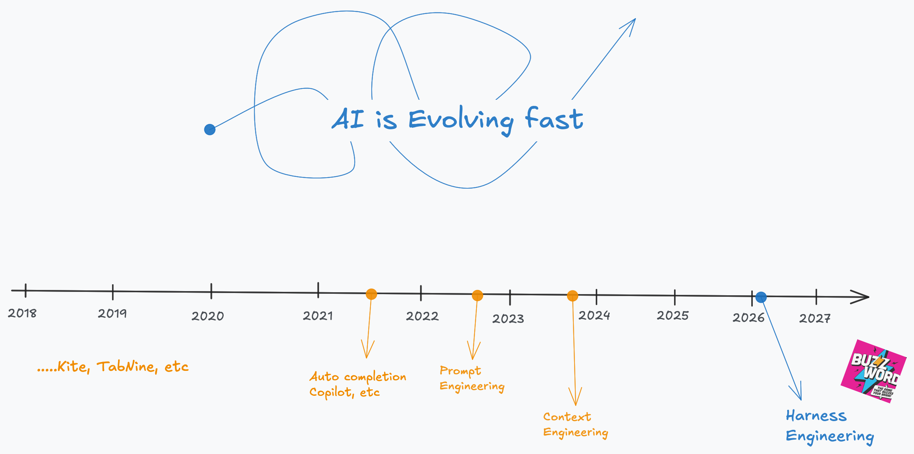

<!--

I still think this is the case,
We are moving so fast and many people are confused!

- Select Model
- Harness engineering 
- Context management
- Guardrail
- etc...
-->

---
layout: center
class: 'text-center'
---

  What was my main pain point when using AI?

Both Personal and Enterprise

---

  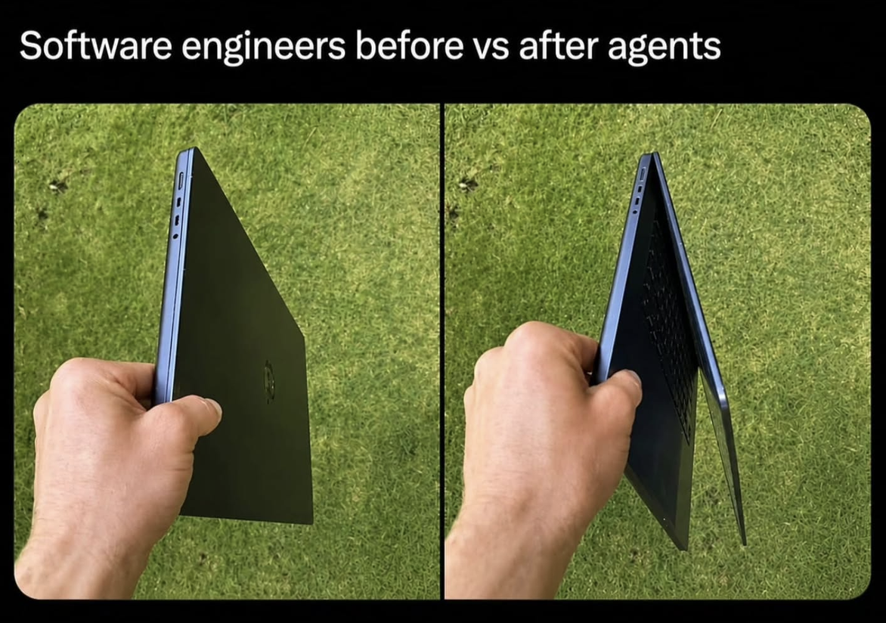

<!--
How many of you have done this?

It is really annoying..

I did, and this happened
-->

---
layout: center
class: 'text-center'
---

  <video class="max-h-[92%] max-w-[94%] rounded-xl" autoplay loop muted playsinline src="./public/IMG_1868.MP4" />

---
layout: center
class: 'text-center'
---

# It is soooo over

  AGI? is this AGI?

<!--
We are kooked!

We are done!

It is soooo over

Then how it will look like?
what should I do?

I was thinking about these ideas about 1 year ago...
-->

---
layout: center
class: 'text-center'
---

# So I built DevM8

  (to be my mate!)

  Dev + M8 — the mate that does the boring work 

---
layout: center
class: 'text-center'
---

# What is DevM8? 

 

A <strong>Rust-based CLI tool</strong> that takes over my daily boring work:

 

-  **Telling AI what to do** — remotely
-  Using the **right skill** for the AI, when it is needed
-  Making **Slack communication** easier
-  **Git branch management** integrated with **Jira**

 

> At that point, there were no accessible Claude agents  
> Today it's easier — doable via almost all agents, natively.

<!--
I am too lazy.
Many of you are!

Jira UI!
Keep branch names and git messages accurate!
Slack and Teams message...

Annnd the laptop closing issue
-->

---

  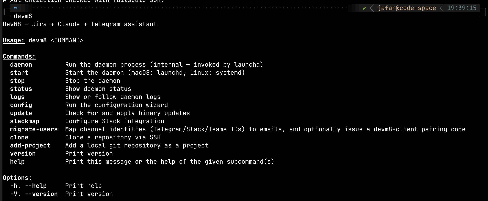

<!--
I think it is better to talk with real visuals..

What are we talking about is a cli
This is server cli

It installs on your server (can be your mac as well)

It manages access to your Agent.
Cuz it nees to be live somewhere 
and not die when you close the laptop
-->

---

# devm8-client cli 

  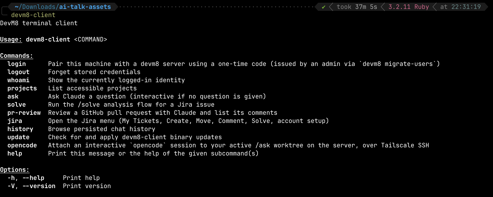

  TUI

<!--
Many laptops?

If you have many different systems
you can pair securely and manage your server

Remote cli to allow accessing..

it is using TUI
help you review PR, manage Jira, work remotely

and can CLOSE the laptop... right?!
cuz we have server
-->

---

# devm8-client cli 

  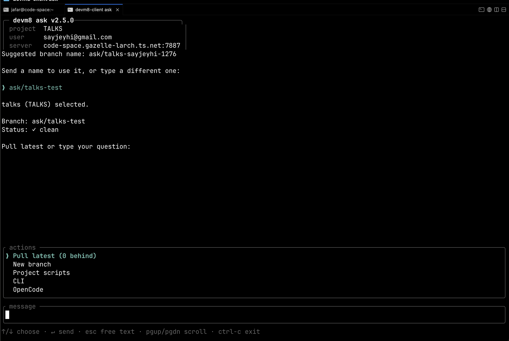

  TUI

<!--
The TUI is minimal but does all the jobs
-->

---

# Telegram bot 
@Devm8_bot

  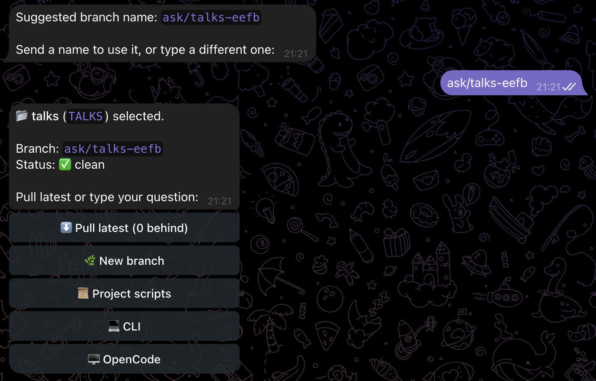

  Agent suggests a branch name → pick a project → one tap: <em>Pull latest · New branch · Project scripts · CLI · OpenCode</em>

<!--
Telegram bots are more powerful and has better UIs

When you start a session you can start from suggested branch name

Then do maaaany actions!
-->

---

# Telegram bot 
@Devm8_bot

  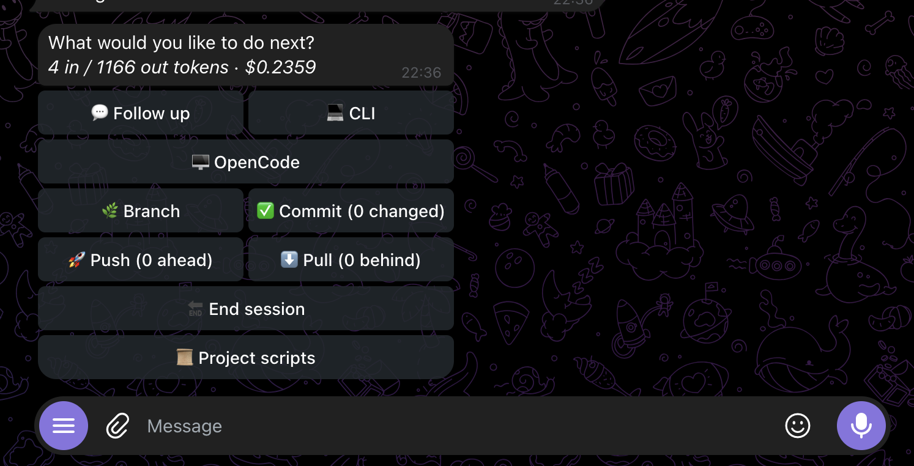

<!--
After when the AI agent is done with job
gives all results and ALL possible actions
-->

---

# I gave it to friends, it got serious 

 

-  **Secure** — every agent run is sandboxed: bubblewrap namespaces, read-only `~/.claude`, `~/.kiro` cleared environment
-  **Multi-tenant** — per-project access control, admin roles, 10-minute pairing codes
-  **Integrated** — Slack and Telegram, plus `devm8-client` for the terminal
-  **Agent-powered** — supporting Claude and Kiro, Base support of Codex

 

> Same assistant, every channel, one shared history. 

 

> It is open source now!

<!--
I was for me only!
but showed friends and they asked..
-->

---

# Where does it live? A homelab 

 

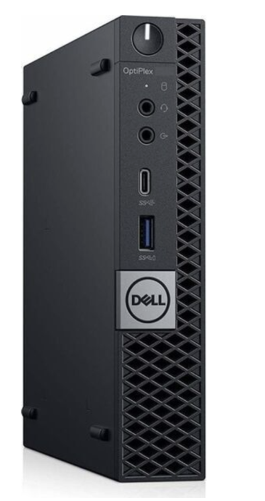

-  **Dell Optiplex 3070 Micro** — a quiet little box, doing real work
-  **AI Agent** — Connected to cloud AI providers
-  **Tailscale** — every device in a private network, ACLs included
-  **OpenCode** — Allows use of opencode within Tailnet VPN and access token

 

> My AI agents are available **24/7, remotely** — from my phone, a laptop, anywhere. 

<!--
How many of you have homelab?

Mac mini, Old laptop, PC?

We love hardware,
It is real engineering.
Or atleast feels like that.
-->

---

# How it's all wired 

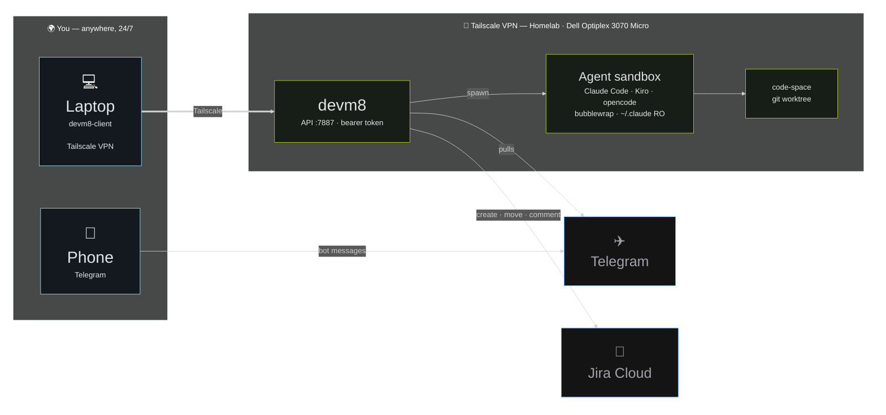

  The only public hops are the bot APIs — everything else rides the tailnet.

<!--
You can read about different setups and you may already have done!

this is more like my setup to demo
-->

---

# Mistakes I made, so you don't have to 

 

-  **Built the weel**: I could clone many parts.

-  **Used bun initialy**: Language is not a bottle-neck anymore, pick wisely
-  **Not planning before implementation**: Multi-tenancy, pairing codes and project access are much cheaper on day one

 

> I do Not regret spending time on devm8, I still use it!

<!--
Initially I made some mistakes, 
Then fixed many of them

Since AI world is evolving so fast..

Lets have a quick demo

Hope demo gods will allow me doing it
-->

---
layout: center
class: 'text-center'
---

# Demo time!

 

  The real thing — live. No screenshots. 

  A ticket from cli opencode → agent on it → branch ready — while we talk.

<!--

This is not all the solution right? 
we have many AI providers solving many of these..
-->

---
layout: center
class: 'text-center'
---

  

    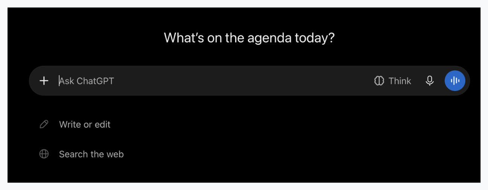
  

  http://chatgpt.com

  

    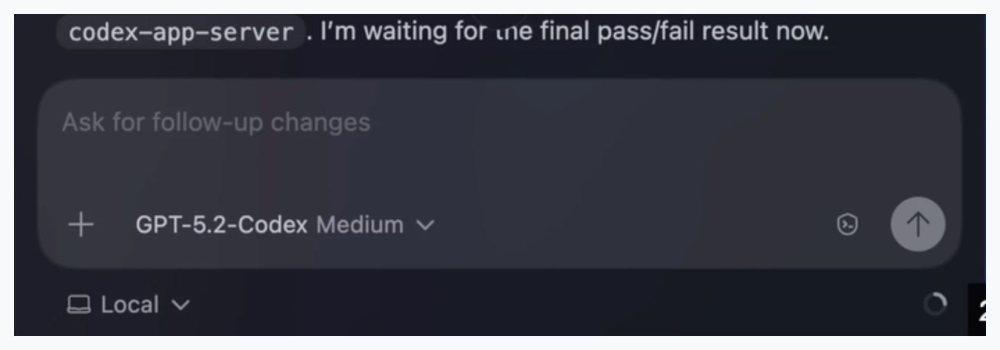
  

  Codex

  Same chat interfaces, isn't it?

<!--
What happens under the hood?
-->

---

  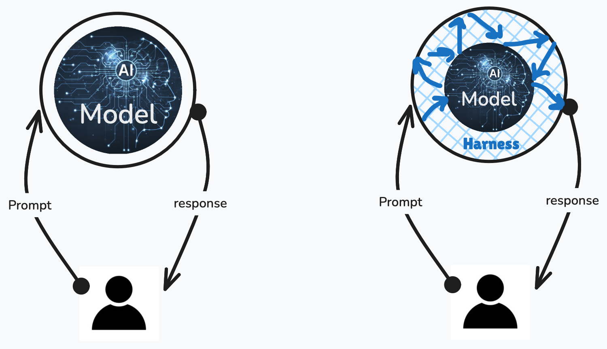

<!--
AI Model is not Harness 
--> 

---
layout: center
class: 'text-center'
---

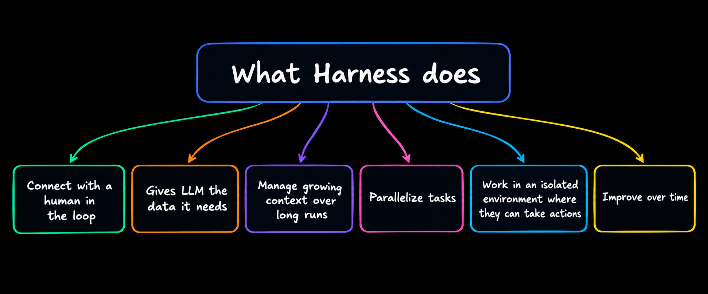
 
<!--
What does happen there?

Human loop
Context management

To take best of harness 
-->

---
layout: center
class: 'text-center'
---

  Lets build a harness?

  

  You are not mentally ill to do so! 

<!--
Dario..

But in some cases it can be useful though

General purpose harnesses are powerful
but in some special cases like maybe finance or sensitive data 

-->

---
layout: center
class: 'text-center'
---

# Demo time!

 

  A basic AI harness to have custom implementation...

<!--
This is a basic run time harness which does 

manages all AI model can do in your code
-->

---

  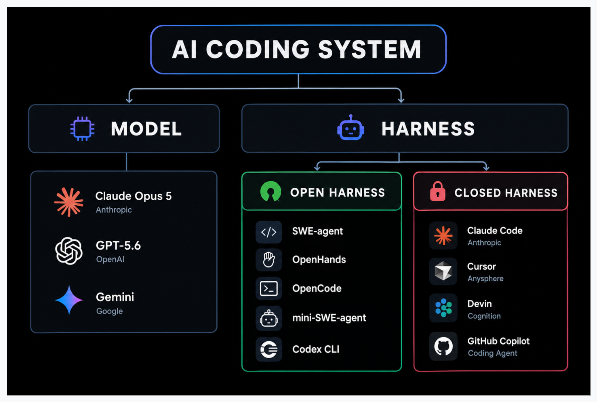

<!--
Good thing is we have many options...

Open and closed sources
-->

---
layout: center
class: 'text-center'
---

  Same prompt to different harnesses 
  uses a different amount of tokens

  [system prompt]

<!--

You can try 
But based on what I tried the different harnesses

spend different amount of tokens for the same prompt in same project
-->

---

  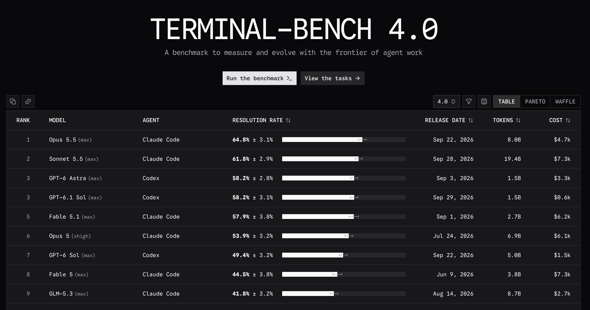

---
layout: center
class: 'text-center'
---

  Rank 30 → top 5

  on <a href="https://www.tbench.ai/">Terminal-Bench 2.0</a> for DeepAgents

  with <strong class="text-[#95E6FF]">harness-only changes</strong>, same model

<a class="text-[11px]" hreaf="https://www.vtrivedy.com/posts/improving-deep-agents-with-harness-engineering">Source: Trivedi, “Improving Deep Agents with Harness Engineering” (LangChain, 2026)</a>

<!--
building a good harness arround the models make a real sense
Usually native runtime harnesses are the best

But there are exceptions
-->

---
layout: center
class: 'text-center'
---

  The LLM is ~10% of an agentic system

  the harness is the other <strong class="text-[#95E6FF]">90%</strong>

 

  Google's <em>The New SDLC With Vibe Coding</em> — conceptual framing

<!--
Google's 2026 paper

The New SDLC With Vibe Coding 

From Ad-hoc Prompting to Agentic Engineering uses the framing:
Agent = Model + Harness

Here the harness doesn't mean claude only
It has parts of it but not all...

SWARM
Validation 
-->

---
layout: center
class: 'text-center'
---

  What model does it use? Or do you use?

 

  is increasingly the <a href="https://magnus919.com/2026/06/stop-picking-models.-start-building-harnesses./" class="bold text-[#CF8377]">wrong question</a>

---
layout: center
class: 'text-center'
---

  at Stripe

  ~1,300 AI-produced PRs / week

  Merged after <strong class="text-[#95E6FF]">human review</strong>

<a class="text-sm" hreaf="https://stripe.dev/blog/minions-stripes-one-shot-end-to-end-coding-agents-part-2">Source: Stripe</a>

<!--
we know that we can't ignore AI 

The speed of AI is increasing pretty fastttt

We said the same thing in HEMA and decided to move faster
-->

---
layout: center
class: 'text-center'
---

  The future is agentic  
  so at HEMA we're building 
  a full harness, just like Claude

  Our own complete agent runtime 

---
layout: center
class: 'text-center'
---

  Lied!

  No custom runtime, we using different <strong>AI Agents</strong> 
  What we <strong class="text-[#BECF24]">Do</strong> have is an <strong class="text-[#BECF24]">Organization Harness</strong> around an agentic CLI

  

---

# Two kinds of harness 

 Runtime harness

    Everything that makes an LLM capable of operating as a <strong class="text-[#95E6FF]">coding agent</strong>.

    Filesystem · shell · tools · context management · skills · sub-agents · permissions · hooks · MCP · compaction

    Shipped (in different forms) by Claude Code, Codex, opencode…

 Engineering harness

    Everything that makes agents <strong class="text-[#BECF24]">reliable and scalable</strong> in an organization's development process.

    Specs · orchestration · workers · validators · evals · guardrails · CI · observability · feedback loops

    The part <em>you</em> build — often where your real edge lives 

 

> Agent = model + runtime harness. <strong>Production agent</strong> = all of it, wrapped in an engineering harness.

    The runtime gives the building blocks (hooks, permissions, sub-agents). The engineering harness uses them at team scale.

---

# What did we want it?

   <strong>Specs / intent layer</strong> — specs as the primary artifact

   <strong>Orchestrator</strong> — spec in, tasks out

   <strong>Workers</strong> — sub-agents, in parallel

   <strong>Validators</strong> — evaluate, never modify

   <strong>ACL</strong> — output, trajectory, tool usage

   <strong>Guardrails / hooks</strong> — around every tool call

   <strong>Observability</strong> — cost, eval scores, drift

   <strong>Feedback loop</strong> — failures flow back to workers

  End to End - Secure - Up to date - Reliable

---

# Meet opa-cli 

  One CLI that controls everything — the whole pipeline, end to end:

  📝 Spec creation
  →
  🎫 Jira ticket
  →
  📄 Create PRD
  →
  🛠️ Implement
  →
  📏 Guidelines

↓

  🔑 AWS profiles
  →
  ⚙️ AWS Pipelines
  →
  🚀 Deploy
  →
  🧪 Test

  Every step of the organization harness — driven by one command.

<!--
It doesn't mean we can one-shot tickets
But we do have a pretty high quality results...
-->

---
layout: center
class: 'text-center'
---

  High-quality input = high-quality output

  + the right <strong class="text-[#95E6FF]">tools</strong> and good <strong class="text-[#95E6FF]">context</strong>, for sure

-  <strong>Inputs</strong> — meeting transcripts, docs, tickets, prior decisions, MCPs built in collaboration to AWS

---

# The engineering harness, end to end 

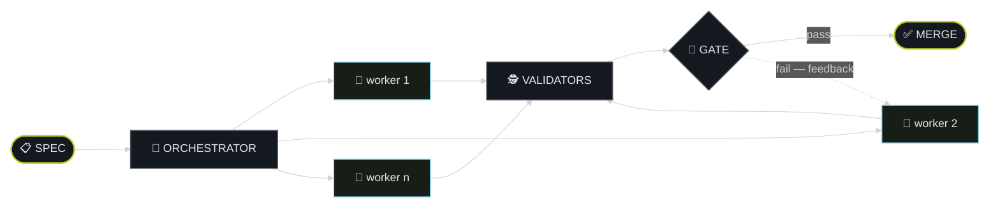

  🕵️ validators evaluate the work — they never modify it

> One spec in — human-reviewed code out. <strong>The loop is the point.</strong> 

---

# Don't rebuild the runtime 

  

    ⚙️ RUNTIME HARNESS — already shipped by your agent CLI
  

  

    🔧 Tool system
    🗂️ File system
    💻 Shell
    🌿 Git
    🧠 Context
    ✨ Skills
    🤖 Sub-agents
    🪝 Hooks
    🔐 Permissions
    🔌 MCP
    🗜️ Compaction
  

  🧠 MODEL + ⚙️ this harness = 🦾 a real coding agent

  Spend your energy one layer up — on the engineering harness you wrap around it 

---

# Resources 

 

## 2026 — fresh

 

- **HEMA's HAL (AWS blog):** [From portal hopping to instant answers](https://aws.amazon.com/blogs/machine-learning/from-portal-hopping-to-instant-answers-hemas-journey-with-mcp-and-amazon-bedrock/)
- **OpenAI DevDay 2026 recap:** [openai.com/index/devday-2026-recap](https://openai.com/index/devday-2026-recap)
- **Anthropic 2026 Agentic Coding Trends:** [resources.anthropic.com](https://resources.anthropic.com/2026-agentic-coding-trends-report)
- **AI coding agent adoption (JetBrains):** [blog.jetbrains.com](https://blog.jetbrains.com/research/2026/08/ai-coding-agent-adoption-2026)
- **autoharness — the self-learning harness:** [github.com/tigerless-labs/autoharness](https://github.com/tigerless-labs/autoharness)
- **myagents — a portable harness:** [github.com/RashadAnsari/myagents](https://github.com/RashadAnsari/myagents)
- **Awesome harness engineering:** [github.com/ai-boost/awesome-harness-engineering](https://github.com/ai-boost/awesome-harness-engineering)

## Foundations

 

- **AI transformation:** [dpereira.substack.com — Just Another Transformation](https://dpereira.substack.com/p/just-another-transformation)
- **Harness engineering:** [martinfowler.com](https://martinfowler.com)
- **DeepSeek Harness:** [github.com/deepseek-ai/deepseek-harness](https://github.com/deepseek-ai/deepseek-harness)
- **DeepSeek Harness explained:** [mindstudio.ai/blog/deepseek-harness-agentic-coding](https://www.mindstudio.ai/blog/deepseek-harness-agentic-coding)
- **Harness deep-dive (video):** [youtu.be/UsfCe5fJK6A](https://youtu.be/UsfCe5fJK6A)
- **Skylos — catch AI mistakes before push:** [github.com/duriantaco/skylos](https://github.com/duriantaco/skylos)

---
layout: center
class: 'text-center'
---

# Thank you! 

 

<a href="github.com/sayjeyhi" >
 github.com/sayjeyhi
</a>
<a href="https://sayjeyhi.com">
 sayjeyhi.com
</a>

  

  <a class="text-left ml-4 mt-2" href="https://github.com/sayjeyhi">
    <strong class="text-xl">Jafar Rezaei</strong>  
    @sayjeyhi
  </a>

<!--

Spec-driven development. GitHub Spec Kit gives you a CLI that turns specs into plans into tasks. OpenSpec adds a three-phase state machine for brownfield changes. BMAD-METHOD ships 21 role-based agents across the full SDLC. Superpowers provides a skills framework with subagent test-driven development. These tools treat specs as the primary artifact. None of them connect a spec to an automated eval suite that verifies the agent actually satisfied what the spec asked for.

Multi-agent orchestration. CrewAI gives you role-based crews with a hierarchical manager that delegates and reviews: the closest thing to orchestrator/worker separation in open source. AutoGen and LangGraph provide graph-based and conversation-driven multi-agent patterns. But here is what none of them enforce: the validator must never touch the implementation. That separation is still a discipline you impose, not a constraint the framework guarantees.

Evaluation. DeepEval and Promptfoo give you frameworks for testing LLM output quality, red-teaming, and vulnerability scanning. LangSmith and Braintrust provide hosted eval platforms with LLM-as-judge capabilities. The missing piece: accepting a structured spec and auto-generating a scenario suite that computes per-requirement satisfaction scores. The spec-to-eval bridge (the thing that tells you whether the agent actually built what you asked for) is unbuilt in open source.

Guardrails. NVIDIA NeMo Guardrails and Guardrails AI provide programmable safety rails for conversational AI. These are not coding harness guardrails. There is no open source framework for pre-commit hooks that block hardcoded credentials, no API call allowlist enforced at the tool level, no eval gate that rejects a pull request below a quality threshold. The guardrail layer for agentic coding is empty.

Observability. Langfuse gives you self-hosted tracing with token cost tracking and latency visibility. Arize Phoenix provides drift detection and RAG evaluation. Here is what neither tracks: spec compliance over time. The measurement that tells you when a spec that used to produce good output has started producing bad output, and why.

-->