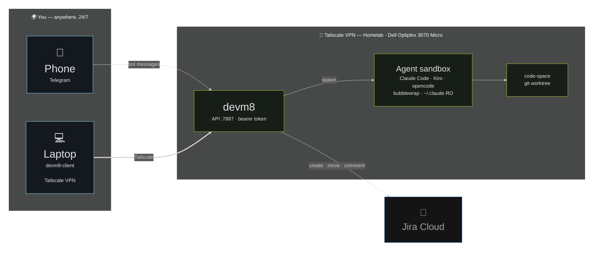
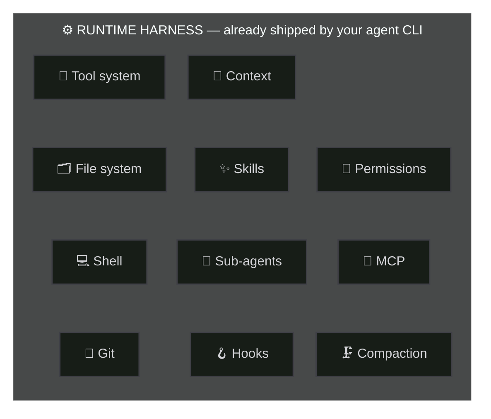

# Building AI Agents for <span class="text-[#BECF24]">Real Work</span>

Lessons from DevM8


<div class="pt-12">
  <span @click="$slidev.nav.next" class="px-2 py-1 rounded cursor-pointer" hover="bg-white bg-opacity-10">
    <carbon:arrow-right class="inline"/>
  </span>
</div>

<div class="avtar mt-20 rounded-full flex w-full align-center justify-center ">
  

  <a class="text-left ml-4 mt-2" href="https://github.com/sayjeyhi">
    <strong class="text-xl">Jafar Rezaei</strong> <br/>
    <span class="text-gray-400 text-sm">VibeKode · October 2026</span>
  </a>
</div>


---

<div class="absolute inset-0 flex items-center justify-center">
  
</div>


---
layout: center
class: 'text-center'
---

<div class="absolute inset-0 flex items-center justify-center">
  <video class="max-h-[92%] max-w-[94%] rounded-xl" autoplay loop muted playsinline src="./public/IMG_1868.MP4" />
</div>

---
layout: center
class: 'text-center'
---


<div class="text-3xl font-black text-zinc-300 tracking-tight leading-snug">
  "I didn't want to do this."
</div>

<br />

<div class="text-2xl text-zinc-400 leading-relaxed">
  I wanted to have my agent <strong class="text-[#BECF24]">ready for me</strong> —<br/>
  when I want it, where I am.
</div>

<p class="text-zinc-500 text-lg mt-8">
  Not glued to a terminal. Not "later, when I'm back at my desk."
</p>


---
layout: center
class: 'text-center'
---


# So I built DevM8

<div class="text-4xl font-black text-zinc-200 mt-4 tracking-tight">
  (to be my <span class="text-[#95E6FF]">mate</span>!)
</div>

<p class="text-zinc-500 text-lg mt-10">
  Dev + M8 — the mate that does the boring work 
</p>


---
layout: center
class: 'text-center'
---

# What is DevM8? 

<br />

<div class="text-xl text-zinc-300">A <strong>Rust-based CLI tool</strong> that takes over my daily boring work:</div>

<br />

<div class="text-lg text-left max-w-2xl mx-auto leading-loose">

-  **Telling AI what to do** — remotely
-  Using the **right skill** for the AI, when it is needed
-  Making **Slack communication** easier
-  **Git branch management** integrated with Jira

</div>

<br />

> <span class="text-sm">At that point, there were no accessible Claude agents <br/>
> Today it's easier — doable via almost all agents, natively.</span>


---

<div class="absolute inset-0 flex items-center justify-center">
  
</div>


---

# I gave it to friends, it got serious 

<br />

<div class="text-lg text-left max-w-3xl mx-auto leading-loose">

-  **Secure** — every agent run is sandboxed: bubblewrap namespaces, read-only `~/.claude`, `~/.kiro` cleared environment
-  **Multi-tenant** — per-project access control, admin roles, 10-minute pairing codes
-  **Integrated** — Slack and Telegram, plus `devm8-client` for the terminal
-  **Agent-powered** — supporting Claude and Kiro, Base support of Codex

</div>

<br />

> Same assistant, every channel, one shared history. 


---

# Your phone is now the terminal 

<br />

Talk to it in Telegram — no browser, no laptop:

```text
/create  /move  /comment  /my_tickets   ← Jira, from the bus
/ask     /solve /history                ← Claude, on your repo
```

<br />

Prefer a keyboard? `devm8-client` gives you the same workflows as a full TUI:

```text
devm8-client ask · solve · pr-review · jira · history · opencode
```

<br />

> One server, one history — phone, laptop, terminal. 

---

# devm8-client cli 

<div class="absolute inset-x-0 top-24 bottom-4 flex items-center justify-center">
  
</div>

<div class="absolute bottom-2 inset-x-0 text-center text-sm text-zinc-500">
  TUI
</div>

---

# devm8-client cli 

<div class="absolute inset-x-0 top-24 bottom-4 flex items-center justify-center">
  
</div>

<div class="absolute bottom-2 inset-x-0 text-center text-sm text-zinc-500">
  TUI
</div>


---

# Telegram bot 
@Devm8_bot

<div class="absolute inset-x-0 top-24 bottom-4 flex items-center justify-center">
  
</div>

<div class="absolute bottom-2 inset-x-0 text-center text-sm text-zinc-500">
  Agent suggests a branch name → pick a project → one tap: <em>Pull latest · New branch · Project scripts · CLI · OpenCode</em>
</div>


---

# Telegram bot 
@Devm8_bot

<div class="absolute inset-x-0 top-24 bottom-4 flex items-center justify-center">
  
</div>


---


# Where does it live? A homelab 

<br />

<div class="grid grid-cols-3 gap-5 mt-4">

<div class="flex items-center justify-center">

</div>

<div class="text-lg col-span-2 text-left max-w-3xl mx-auto leading-loose">

-  **Dell Optiplex 3070 Micro** — a quiet little box, doing real work
-  **AI Agent** — Connected to cloud AI providers
-  **Tailscale** — every device in a private network, ACLs included
-  **OpenCode** — Allows use of opencode within Tailnet VPN and access token

</div>
</div>

<br />

> My AI agents are available **24/7, remotely** — from my phone, a laptop, anywhere. 


---

# How it's all wired 



<p class="text-zinc-500 text-sm mt-2">
  The only public hops are the bot APIs — everything else rides the tailnet.
</p>

---

# Mistakes I made, so you don't have to 

<br />

<div class="text-lg text-left max-w-3xl mx-auto leading-loose">

-  **Built the weel**: I could clone many parts.

-  **Used bun initialy**: Language is not a bottle-neck anymore, pick wisely
-  **Not planning before implementation**: Multi-tenancy, pairing codes and project access are much cheaper on day one

</div>

<br/>

> I do Not regret spending time on devm8, I still use it!


---
layout: center
class: 'text-center'
---


# Demo time!

<br />

<div class="text-2xl font-bold text-zinc-200">
  The real thing — live. No screenshots. 
</div>

<p class="text-zinc-500 text-lg mt-6">
  A ticket from my phone → agent on it → branch ready — while we talk.
</p>

---
layout: center
class: 'text-center'
---

<div class="grid grid-cols-2 gap-8 px-8 h-48">

<div class="flex items-center justify-center">
  
</div>

<div class="flex items-center justify-center">
  
</div>
</div>

<div class="text-3xl font-black text-zinc-300 tracking-tight mt-10">
  "Same chat interfaces, isn't it?"
</div>

---

<div class="absolute inset-0 flex items-center justify-center">
  
</div>
 

---
layout: center
class: 'text-center'
---


<div class="text-4xl font-black text-zinc-200 tracking-tight leading-snug">
  The LLM is ~<span class="text-[#BECF24]">10%</span> of an agentic system
</div>


<div class="text-3xl text-zinc-400 leading-relaxed">
  the harness is the other <strong class="text-[#95E6FF]">90%</strong>
</div>

<br />
<p class="text-zinc-500 text-[12px]">
  Google's <em>The New SDLC With Vibe Coding</em> — conceptual framing
</p>

<!--
Google's 2026 paper

The New SDLC With Vibe Coding 

From Ad-hoc Prompting to Agentic Engineering uses the framing:
Agent = Model + Harness
-->

---
layout: center
class: 'text-center'
---


 
---
layout: center
class: 'text-center'
---


<div class="text-3xl font-black text-zinc-300 tracking-tight leading-snug">
  Same prompt to different harnesses<br/>
  uses a <span class="text-[#BECF24]">different amount of tokens</span>
</div>

---

<div class="absolute inset-0 flex items-center justify-center">
  
</div>

---
layout: center
class: 'text-center'
---


<div class="text-4xl font-black text-zinc-200 tracking-tight leading-snug">
  Rank <span class="text-zinc-500">30</span> → <span class="text-[#BECF24]">top 5</span>
</div>


<div class="text-2xl text-zinc-400 leading-relaxed mt-4">
  on <a href="https://www.tbench.ai/">Terminal-Bench 2.0</a> for DeepAgents
</div>
<div class="text-xl text-zinc-400 leading-relaxed mt-2">
  with <strong class="text-[#95E6FF]">harness-only changes</strong>, same model
</div>

<div class="flex mt-12 opacity-20 justify-center">
<a class="text-[11px]" hreaf="https://www.vtrivedy.com/posts/improving-deep-agents-with-harness-engineering">Source: Trivedi, “Improving Deep Agents with Harness Engineering” (LangChain, 2026)</a>
</div>

---
layout: center
class: 'text-center'
---


<div class="text-3xl text-zinc-400 leading-relaxed">
  at Stripe
</div>

<div class="text-4xl font-black text-zinc-200 tracking-tight leading-snug">
  ~<span class="text-[#BECF24]">1,300</span> AI-produced PRs / week
</div>

<div class="text-xl mt-12 text-zinc-400 leading-relaxed">
  Merged after <strong class="text-[#95E6FF]">human review</strong>
</div>


<div class="flex mt-10 opacity-40 justify-center">
<a class="text-sm" hreaf="https://stripe.dev/blog/minions-stripes-one-shot-end-to-end-coding-agents-part-2">Source: Stripe</a>
</div>


---
layout: center
class: 'text-center'
---


<div class="text-4xl font-black text-zinc-200 tracking-tight leading-snug">
  What model does it use? Or do you use?
</div>

<br />

<div class="text-2xl text-zinc-400 leading-relaxed">
  is increasingly the <a href="https://magnus919.com/2026/06/stop-picking-models.-start-building-harnesses./" class="bold text-[#CF8377]">wrong question</a>
</div>

---
layout: center
class: 'text-center'
---


<div class="text-3xl font-black text-zinc-300 tracking-tight leading-snug">
  The advantage shifts from <em>which</em> model you use<br/>
  → to <strong class="text-[#BECF24]">how well you orchestrate it</strong>
</div>


---
layout: center
class: 'text-center'
---


<div class="text-4xl font-black text-zinc-200 tracking-tight leading-snug">
  The future is agentic —<br/>
  so at HEMA we're building<br/>
  a <span class="text-[#BECF24]">full harness</span>, just like Claude
</div>

<p class="text-zinc-500 text-lg mt-8">
  Our own complete agent runtime 
</p>

---
layout: center
class: 'text-center'
---


<div class="text-4xl font-black text-zinc-200 tracking-tight">
  No… I lied!
</div>

<div class="text-lg text-zinc-400 mt-3 leading-relaxed">
  We don't have a custom runtime harness — and no plan to build one.
</div>

<div class="text-xl text-zinc-300 mt-5">
  What we <strong class="text-[#95E6FF]">do</strong> have is an <strong class="text-[#BECF24]">organization harness</strong> around an agentic CLI:
</div>

<div class="text-sm text-left max-w-4xl mx-auto mt-7 leading-relaxed">
<div class="grid grid-cols-2 gap-x-12 gap-y-3">

<div>
   <strong>Specs / intent layer</strong> — structured specs become the primary artifact
</div>

<div>
   <strong>Orchestrator</strong> — reads the spec, decomposes it into tasks
</div>

<div>
   <strong>Workers</strong> — sub-agents implement tasks independently
</div>

<div>
   <strong>Validators</strong> — evaluate the work, never modify it
</div>

<div>
   <strong>Evals</strong> — deterministic output + trajectory & tool usage
</div>

<div>
   <strong>Guardrails / hooks</strong> — before tool calls, after edits, before commits
</div>

<div>
   <strong>Observability</strong> — token cost, eval scores, drift
</div>

<div>
   <strong>Feedback loop</strong> — failed validation goes back to the workers
</div>

</div>
</div>
---

# The engineering harness, end to end 


<p class="text-zinc-500 text-sm -mt-2 text-left ml-10">
  🕵️ validators evaluate the work — they never modify it
</p>

> One spec in — human-reviewed code out. <strong>The loop is the point.</strong> 

---

# Two kinds of harness 

<div class="grid grid-cols-2 gap-8 mt-8 text-left">

<div class="border-2 border-[#95E6FF]/40 rounded-2xl p-6 bg-white/[0.02]">
  <div class="text-2xl font-black text-zinc-100 tracking-tight">
     Runtime harness
  </div>
  <p class="text-zinc-400 mt-4 leading-relaxed">
    Everything that makes an LLM capable of operating as a <strong class="text-[#95E6FF]">coding agent</strong>.
  </p>
  <div class="text-sm text-zinc-500 mt-5 leading-relaxed">
    Filesystem · shell · git · tools · context management · skills · sub-agents · permissions · hooks · MCP · compaction
  </div>
  <div class="text-xs text-zinc-600 mt-4">
    Shipped for you by Claude Code, Codex, opencode…
  </div>
</div>

<div class="border-2 border-[#BECF24]/40 rounded-2xl p-6 bg-white/[0.02]">
  <div class="text-2xl font-black text-zinc-100 tracking-tight">
     Engineering harness
  </div>
  <p class="text-zinc-400 mt-4 leading-relaxed">
    Everything that makes agents <strong class="text-[#BECF24]">reliable and scalable</strong> in an organization's development process.
  </p>
  <div class="text-sm text-zinc-500 mt-5 leading-relaxed">
    Specs · orchestration · workers · validators · evals · guardrails · CI · observability · feedback loops
  </div>
  <div class="text-xs text-zinc-600 mt-4">
    The part <em>you</em> build — where your real edge lives 
  </div>
</div>

</div>

<br/>

> Agent = model + runtime harness. <strong>Production agent</strong> = all of it, wrapped in an engineering harness.

---

# Don't rebuild the runtime 



<div class="text-center text-2xl font-black text-zinc-200 tracking-tight mt-3">
  🧠 MODEL <span class="text-zinc-500">+</span> ⚙️ this harness <span class="text-zinc-500">=</span> <span class="text-[#BECF24]">🦾 a real coding agent</span>
</div>

<p class="text-zinc-500 text-sm mt-2">
  Spend your energy one layer up — on the <span class="text-[#BECF24]">engineering harness</span> you wrap around it 
</p>

---
layout: center
class: 'text-center'
---


<div class="text-4xl font-black text-zinc-200 tracking-tight">
  What to remember
</div>

<div class="text-lg text-zinc-400 mt-10 leading-loose text-left max-w-2xl mx-auto">

-  The model is ~10% of an agentic system — <strong class="text-[#BECF24]">the harness is the 90%</strong>
-  Two harnesses: <strong class="text-[#95E6FF]">runtime</strong> makes an agent, <strong class="text-[#95E6FF]">engineering</strong> makes it production-grade
-  Meet your agent where you are — <strong class="text-[#CF8377]">phone, terminal, anywhere</strong>

</div>


---

# Resources 

<br />

<div class="text-sm grid grid-cols-2 gap-x-10 text-left">

<div>

**2026 — fresh**

- **HEMA's HAL (AWS blog):** [From portal hopping to instant answers](https://aws.amazon.com/blogs/machine-learning/from-portal-hopping-to-instant-answers-hemas-journey-with-mcp-and-amazon-bedrock/)
- **OpenAI DevDay 2026 recap:** [openai.com/index/devday-2026-recap](https://openai.com/index/devday-2026-recap)
- **Anthropic 2026 Agentic Coding Trends:** [resources.anthropic.com](https://resources.anthropic.com/2026-agentic-coding-trends-report)
- **AI coding agent adoption (JetBrains):** [blog.jetbrains.com](https://blog.jetbrains.com/research/2026/08/ai-coding-agent-adoption-2026)
- **autoharness — the self-learning harness:** [github.com/tigerless-labs/autoharness](https://github.com/tigerless-labs/autoharness)
- **myagents — a portable harness:** [github.com/RashadAnsari/myagents](https://github.com/RashadAnsari/myagents)
- **Awesome harness engineering:** [github.com/ai-boost/awesome-harness-engineering](https://github.com/ai-boost/awesome-harness-engineering)

</div>

<div>

**Foundations**

- **AI transformation:** [dpereira.substack.com — Just Another Transformation](https://dpereira.substack.com/p/just-another-transformation)
- **Harness engineering:** [martinfowler.com](https://martinfowler.com)
- **DeepSeek Harness:** [github.com/deepseek-ai/deepseek-harness](https://github.com/deepseek-ai/deepseek-harness)
- **DeepSeek Harness explained:** [mindstudio.ai/blog/deepseek-harness-agentic-coding](https://www.mindstudio.ai/blog/deepseek-harness-agentic-coding)
- **Harness deep-dive (video):** [youtu.be/UsfCe5fJK6A](https://youtu.be/UsfCe5fJK6A)
- **Skylos — catch AI mistakes before push:** [github.com/duriantaco/skylos](https://github.com/duriantaco/skylos)

</div>

</div>


---
layout: center
class: 'text-center'
---

# Q&A 

<br />

<div class="text-2xl font-bold text-zinc-200">

"So… what would you let <em>your</em> agent do?" 

</div>

<div class="mt-10 text-lg">

`github.com/sayjeyhi/DevM8` 

</div>

<div class="avtar mt-12 rounded-full flex w-full align-center justify-center ">
  

  <a class="text-left ml-4 mt-2" href="https://github.com/sayjeyhi">
    <strong class="text-xl">Jafar Rezaei</strong> <br/>
    <span class="text-gray-400 text-sm">@sayjeyhi</span>
  </a>
</div>

<!--

Spec-driven development. GitHub Spec Kit gives you a CLI that turns specs into plans into tasks. OpenSpec adds a three-phase state machine for brownfield changes. BMAD-METHOD ships 21 role-based agents across the full SDLC. Superpowers provides a skills framework with subagent test-driven development. These tools treat specs as the primary artifact. None of them connect a spec to an automated eval suite that verifies the agent actually satisfied what the spec asked for.

Multi-agent orchestration. CrewAI gives you role-based crews with a hierarchical manager that delegates and reviews: the closest thing to orchestrator/worker separation in open source. AutoGen and LangGraph provide graph-based and conversation-driven multi-agent patterns. But here is what none of them enforce: the validator must never touch the implementation. That separation is still a discipline you impose, not a constraint the framework guarantees.

Evaluation. DeepEval and Promptfoo give you frameworks for testing LLM output quality, red-teaming, and vulnerability scanning. LangSmith and Braintrust provide hosted eval platforms with LLM-as-judge capabilities. The missing piece: accepting a structured spec and auto-generating a scenario suite that computes per-requirement satisfaction scores. The spec-to-eval bridge (the thing that tells you whether the agent actually built what you asked for) is unbuilt in open source.

Guardrails. NVIDIA NeMo Guardrails and Guardrails AI provide programmable safety rails for conversational AI. These are not coding harness guardrails. There is no open source framework for pre-commit hooks that block hardcoded credentials, no API call allowlist enforced at the tool level, no eval gate that rejects a pull request below a quality threshold. The guardrail layer for agentic coding is empty.

Observability. Langfuse gives you self-hosted tracing with token cost tracking and latency visibility. Arize Phoenix provides drift detection and RAG evaluation. Here is what neither tracks: spec compliance over time. The measurement that tells you when a spec that used to produce good output has started producing bad output, and why.

-->