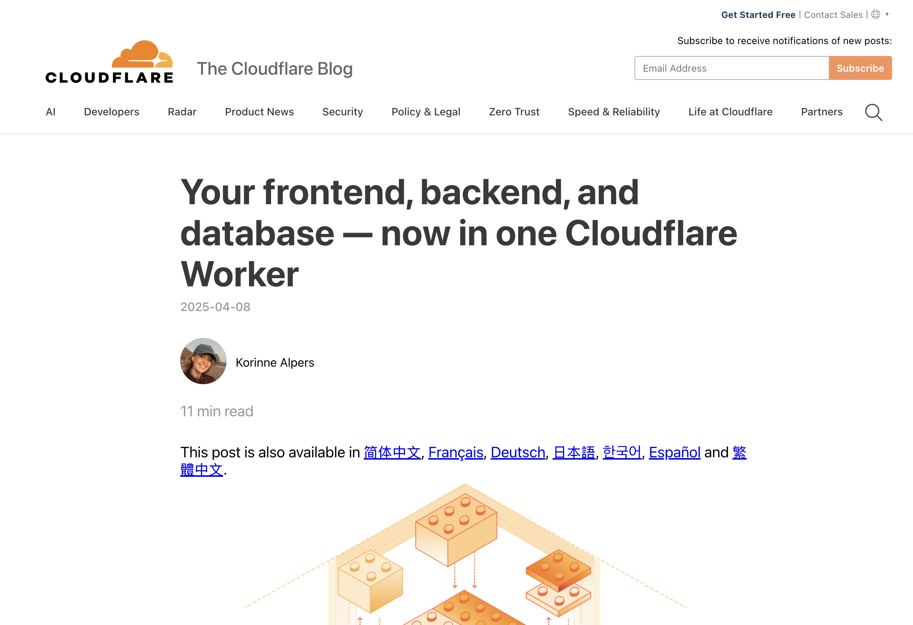
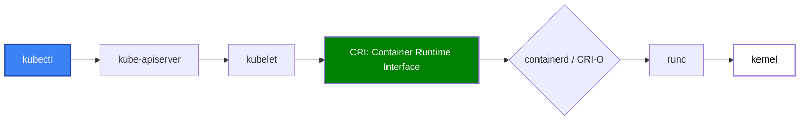

# 🚢 How to Ship – Zero to Hero

## Deploy a Production-Ready App, Using K8S in One Day


<div class="pt-12">
  <span @click="$slidev.nav.next" class="px-2 py-1 rounded cursor-pointer" hover="bg-white bg-opacity-10">
    <carbon:arrow-right class="inline"/>
  </span>
</div>

<div class="avtar mt-36 rounded-full flex w-full align-center justify-center ">
  

  <a class="text-left ml-4 mt-2" href="https://github.com/sayjeyhi">
    <strong class="text-xl">Jafar Rezaei</strong> <br/>
    <span class="text-gray-400 text-sm">August 2025</span>
  </a>
</div>

---


# 📅 Workshop Schedule
Steps we have

<div class="col-span-2">

<header class="my-4 flex items-center gap-2">
  <span class="text-2xl inline-flex h-8 w-8 items-center justify-center rounded-xl bg-amber-100 text-amber-700 dark:bg-amber-900/30 dark:text-amber-300">🌅</span>
  <h3 class="text-lg font-semibold">Morning Sessions</h3>
</header>


<div class="flex flex-col [&>div]:flex gap-2 [&>div]:justify-between [&>div]:items-center [&>div]:flex-row-reverse">
  <div>
    <span class="bg-slate-200 text-[9px] p-[2px] rounded text-slate-700">09:30-09:50</span> 🚀  Kickoff & Requirements
  </div>
  <div>
    <span class="bg-slate-200 text-[9px] p-[2px] rounded text-slate-700">09:50-10:30</span> 🌎  Get domain, server, and DNS ready
  </div>
  <div>
    <span class="bg-slate-200 text-[9px] p-[2px] rounded text-slate-700">10:30-10:50</span> 🔒  Secure the Server
  </div>
  <div>
    <span class="bg-slate-200 text-[9px] p-[2px] rounded text-slate-700">10:50-11:20</span> ⏳  History of Deployment
  </div>
  <div>
    <span class="bg-slate-200 text-[9px] p-[2px] rounded text-slate-700">11:20-12:00</span> ⚙️  Install Kubernetes
  </div>
</div>

<div class="mt-12 text-center opacity-70">
  we have x2 ☕️ Coffee Breaks <span class="text-xs">[10m each]</span>
</div>
</div>

---

# 📅 Workshop Schedule

<div class="flex flex-col">
  <h4 class="text-lg font-semibold">Lunch Break 12:00 - 12:45</h4>
  
</div>


---

# 📅 Workshop Schedule
Steps we have

<header class="mb-4 flex items-center gap-2">
  <span class="text-2xl inline-flex h-8 w-8 items-center justify-center rounded-xl bg-sky-100 text-sky-700 dark:bg-sky-900/30 dark:text-sky-300">🌇</span>
  <h3 class="text-lg font-semibold">Afternoon Sessions</h3>
</header>


<div class="flex flex-col [&>div]:flex gap-2 [&>div]:justify-between [&>div]:items-center [&>div]:flex-row-reverse">
  <div>
    <span class="bg-slate-200 text-[9px] p-[2px] rounded text-slate-700">13:00-13:50</span> 🐳  Build & Push Docker App
  </div>
  <div>
    <span class="bg-slate-200 text-[9px] p-[2px] rounded text-slate-700">13:50-14:50</span> 🚀  Deploy to Kubernetes
  </div>
  <div>
    <span class="bg-slate-200 text-[9px] p-[2px] rounded text-slate-700">14:50-15:20</span> 🔐 Add HTTPS with cert-manager
  </div>
  <div>
    <span class="bg-slate-200 text-[9px] p-[2px] rounded text-slate-700">15:20-16:00</span> 🤖 Set Up CI/CD
  </div>
  <div>
    <span class="bg-slate-200 text-[9px] p-[2px] rounded text-slate-700">16:00-16:20</span> 📊 Monitoring & Logs
  </div>
  <div>
    <span class="bg-slate-200 text-[9px] p-[2px] rounded text-slate-700">16:20-17:00</span> 💬  Wrap-Up & Q&A
  </div>
</div>

<div class="mt-12 text-center opacity-70">
  we have x2 ☕️ Coffee Breaks <span class="text-xs">[10m each]</span>
</div>

---
layout: section
class: text-center
---

# 🚀
Step 1
# Kickoff & Requirements

**09:30 – 09:50**

---

# Why this workshop?
> Why do we need to learn about Deployment, Kubernetes, Docker, and Linux?

<br/>

<v-clicks>

- 🛠 **Market Needs**: Kubernetes, Docker, Linux are the industry standard for deployment.
- 🚀 **Hands-On Experience**: Learn by doing, not just theory.
- 🌐 **Full Cycle**: From domain to deployment, cover the entire lifecycle.
- 💡 **Real-World Skills**: Gain practical skills that employers value.
- 🎯 **Goal-Oriented**: You'll have a fully deployed app with CI/CD.

</v-clicks>


---

# 🎯 What will you learn?

By the end of this full-day, hands-on workshop:


<br/>
<br/>

- Ship a production-ready next.js app using Kubernetes having CI/CD pipelines


<br/>
<br/>
<br/>


<v-click>


<div class="flex flex-col justify-start gap-2 text-sm bg-gray-900 p-2 border-l-4 border-solid border-gray-300 rounded">
  <h4>This is a hands-on workshop!</h4>
  <div class="flex gap-2 items-center">
     Try to follow up each step and get the most out of it.
     
  </div>
</div>

</v-click>

---

# 🏗 Technology Stack

<div class="grid grid-cols-2 gap-8">

<div>

## Infrastructure
- 🌐 **Server** (Hetzner/DigitalOcean/Vultr)
- 🔗 **Domain + Cloudflare DNS**
- 🔒 **Ubuntu Server** (secured)
- ⚙️ **k3s Kubernetes** (lightweight)

</div>

<div>

## Application & Deployment
- 🐳 **Docker** containers
- 🚀 **Kubernetes** deployments
- 🌐 **Traefik Ingress**
- 🔐 **Let's Encrypt HTTPS**
- 🤖 **GitHub Actions CI/CD**

</div>

</div>

<br>


<div class="bg-green-50 border-l-4 border-green-400 p-4">
  <p class="text-green-800 font-semibold">💡 Why this stack?</p>
  <p class="text-green-700">Production-ready, cost-effective, and industry-standard tools that scale.</p>
</div>


---

# ✅ What is not required
You don't need to be worried if you don't have experience in the following topics, we will cover them during the workshop:

<div class="text-sm">

<br/>
<br/>

- **Linux** deep knowledge (Ubuntu Server - we will use basic commands)
- **Docker** experience (You will learn basics and a Dockerfile will be provided)
- **Kubernetes** knowledge (You will learn the basics and we will use simple YAML files)
- **AWS or Azure** k8s experience (We will use k3s, a lightweight version of Kubernetes)
- **CI/CD** setup
- **Nextjs** experience (We will use a simple Next.js app as an example)


</div>

---
layout: two-cols
---

# ✅ What is required?

<div class="text-sm">

<br/>
<br/>
<br/>

## 🔐 Accounts

<br/>

- **GitHub** (To publish docker images)
- **Cloudflare** (DNS)
- **Server provider** (Hetzner, DigitalOcean)
- **Domain**
  - your domain connected to cloudflare
  - OR I will give you a sub domain
  - https://XX.iwaskidding.com/

</div>

::right::

<div class="text-sm">

<div class="mb-12 px-4 bg-red-50 border border-red-200 rounded">
  <p class="text-red-700 text-sm flex items-center gap-4">
    <span class="text-2xl">⚠️ </span> It is better to have requisites ready before we start!
  </p>
</div>

## 💻 Required Tools

<br/>

- **SSH client + terminal** (mac default terminal has it)
- **Git** (mac default terminal has it)
- **Docker** (preferably OrbStack)
- **Editor** (vscode, cursor, etc)


## 🎯 Optional

<br/>

- **Docker Hub** account

</div>

---

# Git repository
How should we get started?

### We will use a Git repository to manage our code and configurations.

<br>


```bash
git clone https://github.com/sayjeyhi/shipping-apps-zero-to-hero.git
```

<br/>

- We will push new tags to this repository as we go through the workshop.

---
layout: section
class: text-center
---
 
🚀 Clone and Get ready ([step01-get-ready.md](https://github.com/sayjeyhi/shipping-apps-zero-to-hero/blob/main/step01-get-ready.md))

```bash
git clone https://github.com/sayjeyhi/shipping-apps-zero-to-hero.git
```

<!-- Your turn -->
<div class="flex items-center justify-center gap-4">
  
</div>

---
layout: section
class: text-center
---

## 🌐 Step 2 
# Provision Domain & Server

Let's get our infrastructure foundation ready!

**10:00 – 10:30**


---

# 🌐 Provision Domain & Server

<br>

## Step 1: Get Your Domain


<br>

- 🛒 **Buy a domain** (if you don't have one)
  - Recommended: Namecheap, Google Domains, or your preferred registrar
  - Example: `myawesomeapp.com`

- If you don't have a domain, you can use a subdomain from my domain: 

`XX.iwaskidding.com` (replace XX with your name or initials)

---

# Step 2: Set Up DNS Provider

| Provider                       | Best For                                           | Downsides                                                              |
|--------------------------------|----------------------------------------------------|-------------------------------------------------------------------------|
| **Cloudflare**                 | Speed, free plan, security, easy API               | If you don’t want traffic going through their proxy, some features are irrelevant |
| **AWS Route 53**               | Enterprise reliability, AWS integration, health checks | Paid per query, UI less beginner-friendly                              |
| **Google Cloud DNS**           | Fast, simple, integrates with GCP                  | Paid, fewer advanced features than Cloudflare                          |
| **DNS Made Easy**              | Enterprise failover, blazing speed                 | Paid, not as beginner-friendly                                         |
| **Namecheap / Registrar DNS**  | Simplicity, no extra cost                           | Often slower, fewer features                                           |
| **Hurricane Electric Free DNS**| Free, reliable, good for secondary DNS              | Lacks advanced filtering and UI polish                                 |


---

# Step 2: Set Up DNS Provider


- ☁️ **Set up Cloudflare DNS Hosting**

<br />

  1. Add your domain to Cloudflare
  2. Update nameservers at your registrar
  3. Wait for DNS propagation (usually 5-15 minutes)


<br />

```bash
# Test DNS propagation
nslookup yourdomain.com 1.1.1.1
```

the second parameter (1.1.1.1) is the DNS server you want to query instead of your system’s default DNS server.


---


# 🖥 Create a local test server


#### Use **VirtualBox** to create a local **Ubuntu** server

After downloading VirtualBox, create a **new VM** and choose Ubuntu server **iso** file to install it.
Then open it and check the IP address of your server:

```bash
ip -br a
```

Allow network access to your server by opening the necessary ports in your firewall. You can use UFW (Uncomplicated Firewall) to manage your firewall rules.

```bash
sudo ufw allow ssh

sudo apt update
sudo apt install openssh-server
```

---

# 🖥 Provision Your Server

<div class="flex items-center justify-center gap-4 text-2xl mt-40">
<p class="text-center w-4/5">We will use a cloud server for this workshop, but we need the local server to test some of the configs locally.</p>
</div>

---

# 🖥 Provision Your Server

## Get a Cloud Server

<br />

- 🌟 **Choose your provider** (we recommend Hetzner for cost-effectiveness)
- 🐧 **Ubuntu 22.04 LTS** (minimum 2GB RAM, 1 CPU)
- 🌍 **Select region** closest to your users
- 🔑 **Add SSH key** during creation (more secure than passwords)

<br />

```bash
# SSH into your new server
ssh root@YOUR_SERVER_IP

# First command on your server
apt update && apt upgrade -y
```


---

# Create user

Create a New User with Sudo Permissions

```bash
# Log in as root
ssh root@IP_ADDRESS

# Create a new user
adduser workshop

# Add the user to the sudo group
usermod -aG sudo workshop

# Test the new user
su - workshop
sudo apt update
```

**`-aG sudo`** means: 

Append the user `workshop` to the sudo group without removing them from any other groups they already belong to.


---

# Use SSH
**SSH (Secure SHell)** is a protocol for securely accessing remote computers.
**Instead of password**, we will use SSH keys for authentication.

- **Automatically** copy your SSH key to the server:
```bash
# local machine (generate SSH key if you don't have one):
ssh-keygen -t ed25519 -C "your-email@example.com"

# Copy public key to server
ssh-copy-id root@YOUR_SERVER_IP
```

- Or **Manually** copy your SSH key to the server:
```bash
# local machine:
cat ~/.ssh/id_ed25519.pub

# copy the output and paste it into the server
mkdir -p ~/.ssh
echo "your-public-key-here" >> ~/.ssh/authorized_keys
chmod 700 ~/.ssh
chmod 600 ~/.ssh/authorized_keys
```

---


# 🔗 Configure DNS

## Step 3: Point Domain to Server

In your Cloudflare dashboard:

- 🎯 **A Record**: `@` → `YOUR_SERVER_IP`
- 🎯 **A Record**: `www` → `YOUR_SERVER_IP`  
- 🎯 **A Record**: `*` → `YOUR_SERVER_IP` (wildcard for subdomains)

<br>

```bash
# Test DNS resolution
ping yourdomain.com
```


<v-click>


<div class="flex flex-col mt-12 justify-start gap-2 text-sm bg-gray-900 p-2 border-l-4 border-solid border-gray-300 rounded">
  <h4>⏰ &nbsp;How long will it take?</h4>
  <div class="flex gap-2 items-center">
    DNS changes can take up to 24 hours to fully propagate, but usually work within minutes with Cloudflare.
  </div>
</div>


</v-click>


---
layout: section
class: text-center
---

Get your domain and server ready ([step02-get-server.md](https://github.com/sayjeyhi/shipping-apps-zero-to-hero/blob/main/step02-get-server.md))

<!-- Your turn -->
<div class="flex items-center justify-center gap-4">
  
</div>

---
layout: section
class: text-center
---

### 🔒 Step 3 
# Secure the Server

Security first! Let's lock down our server.

**10:15 – 11:00**

---

# 🛡 Disable Root Login & Enable Firewall

## Harden SSH Access


```bash
# Open SSH configuration file
sudo nano /etc/ssh/sshd_config

# Modify the following in the file:
# PermitRootLogin no # Disable root login
# PasswordAuthentication no  # Disable password based auth

# Restart SSH service
sudo systemctl restart ssh
```

<div class="flex flex-col my-6 justify-start gap-2 text-sm bg-gray-900 p-2 border-l-4 border-solid border-gray-300 rounded">
  <h4>⚠️ &nbsp;Alert!</h4>
  <div class="flex gap-2 items-center">
    DON`T CLOSE session, open another terminal, and test login:
  </div>
</div>


```bash
# Test SSH with new settings before logging out
ssh test@IP_ADDRESS
```

<span class="text-xs">

if you have created custom SSH key, you need to pass **`-i ~/.ssh/CUSTOM_SSH_KEY`** to the command above.

</span>

---

# 🔥 Uncomplicated Firewall (UFW)

## Step 3: Configure Basic Firewall

<v-click>

```bash
# Install UFW if not already installed
sudo apt install ufw
```

```bash
# Allow necessary ports
sudo ufw allow OpenSSH    # SSH
sudo ufw allow 80/tcp     # HTTP
sudo ufw allow 443/tcp    # HTTPS
```
```bash
# Allow Kubernetes ports
sudo ufw allow 6443/tcp #apiserver
sudo ufw allow from 10.42.0.0/16 to any #pods
sudo ufw allow from 10.43.0.0/16 to any #services
```
```bash
# Enable UFW
sudo ufw enable

# Check UFW status
sudo ufw status
```

</v-click>

---

# Base network


---

# 🔥 Setup Fail2Ban
https://github.com/fail2ban/fail2ban

<v-clicks>

```bash
# Install Fail2Ban
sudo su -
sudo apt update
sudo apt install fail2ban
```

```bash
# Check if it is running
sudo systemctl status fail2ban
sudo tail -f /var/log/auth.log
```

Check current filters:


```bash
cd /etc/fail2ban/filter.d
ls -l
```

Check current jails:

```bash
cat /etc/fail2ban/jail.conf
```

</v-clicks>

---

# Custom SSH Jail
if you don't want to disable password authentication

```bash
tee /etc/fail2ban/jail.d/sshd.local > /dev/null <<'EOF'
[sshd]
enabled = true
port = 22
logpath = /var/log/auth.log
maxretry = 3
findtime = 30
bantime = 300
ignoreip = 127.0.0.1 ::1 192.168.1.0/24
EOF
```

Do not block for a long time, since it can add unnecessary load to the server firewall.


---

# IP tables & NF tables

| Feature            | **iptables**                                                      | **nftables**                                              |
|--------------------|-------------------------------------------------------------------|-----------------------------------------------------------|
| **Introduced**     | Legacy (Linux 2.4, \~2001)                                        | Modern replacement (Linux 3.13, 2014)                     |
| **Backend**        | Separate tools (`iptables`, `ip6tables`, `arptables`, `ebtables`) | Unified framework (`nft`) handles IPv4, IPv6, ARP, bridge |
| **Performance**    | Less efficient (multiple hooks, chains)                           | Faster (single ruleset engine, reduced duplication)       |
| **Syntax**         | Verbose, rule-by-rule                                             | More concise, supports sets, maps, and verdict chains     |
| **Extensibility**  | Limited, harder to maintain                                       | Extensible, cleaner kernel API                            |
| **Future Support** | Deprecated, still maintained for legacy                           | Actively developed, future standard                       |


```bash
# Check current iptables rules
sudo iptables -L -n -v
# Check current nftables rules
sudo nft list ruleset
```

Adding a rule to block a specific IP address:

```bash
# Using iptables
sudo iptables -A INPUT -s

# Using nftables
sudo nft add rule ip filter input ip saddr
```


---
layout: section
class: text-center
---

<!-- Your turn -->

Let's secure the servers ([step03-harden-server.md](https://github.com/sayjeyhi/shipping-apps-zero-to-hero/blob/main/step03-harden-server.md))

<div class="flex items-center justify-center gap-4">
  
</div>

---
layout: section
class: text-center
---

### ⚙️ Step 4
# Install Kubernetes

Time to get our Kubernetes cluster running!

**11:00 – 12:00**

---

# What is k3s?

<br/>

The **certified** Kubernetes distribution built for IoT & Edge computing

<br />

- 🪶 **Lightweight Kubernetes** - Perfect for single-node setups
- 📦 **Batteries included** - Comes with ingress controller, DNS, etc.
- 🚀 **Production ready** - Used by many companies
- 🔧 **Easy to install** - Single command installation

---

# ⚙️ Install k3s
It is simple!

https://k3s.io/

```bash
# Install k3s (this may take a few minutes)
curl -sfL https://get.k3s.io | sh -
```

<br/>

### Check if it's running  

```bash
sudo systemctl status k3s
```

---

# Check cluster

## Allow `kubectl` to access k3s
Lets check the state of k8s on your server


- Set `KUBECONFIG`:

```bash
# Set KUBECONFIG environment variable
echo "export KUBECONFIG=/etc/rancher/k3s/k3s.yaml" >> ~/.bashrc
source ~/.bashrc
```

- Test resources:

```bash
kubectl get nodes
kubectl get pods -A
```


---

# ✅ Verify Cluster

## Check Everything Works


```bash
# Check node status
kubectl get nodes -o wide

# Check system pods
kubectl get pods -n kube-system

# Check k3s components
kubectl get all -n kube-system
```


Expected output should show:
- ✅ Node in "Ready" status  
- ✅ All system pods "Running"
- ✅ traefik (ingress controller) running
- ✅ coredns running


---

# 🎉 Success!

<div class="bg-green-50 border-l-4 border-green-400 p-4 mt-4">
  <p class="text-green-700">You now have a working Kubernetes cluster!</p>
</div>

Let's connect to it locally and check it from your local machine.

---

# Lens App

https://k8slens.dev/


---

# Connect to cluster locally

```bash
# On the server - get the kubeconfig
sudo cat /etc/rancher/k3s/k3s.yaml

# Copy this content to your local machine
# Replace 127.0.0.1 with your server IP
```

```bash
# On your local machine
mkdir -p ~/.kube
nano ~/.kube/config
# Paste the k3s.yaml content here (with server IP updated)
```

```bash
# Test connection
kubectl get nodes
kubectl get pods --all-namespaces
```

---
layout: section
class: text-center
---

Make sure your cluster is ready and you are connected to it locally ([step04-install-k3s.md](https://github.com/sayjeyhi/shipping-apps-zero-to-hero/blob/main/step04-install-k3s.md))

<!--- Your turn to deploy! --->
<div class="flex items-center justify-center gap-4">
  
</div>


---
layout: section
class: text-center
---

## 🍕 
# Lunch Break
Refuel and get ready for the deployment phase!

**We will start at 13:00**


---

# History of Deployment
Some of the deployment methods are still in use, but not as much as before.

> Dates are showing when it became a mainstream/hyped

<div class="relative mt-20 border-s-2 border-slate-200 pl-4 ms-4 text-slate-200">
  <div class="mb-10 ms-4">
    <span class="absolute -start-[9px] top-1 flex h-4 w-4 items-center justify-center rounded-full ring-8 bg-blue-600 ring-blue-100">
      <span class="sr-only">Current</span>
    </span>
    <time class="mb-1 block text-sm font-medium">🗓️ 1990s – Early 2000s</time>
    <h2 class="text-lg font-semibold text-blue-400">Manual Upload (FTP / SFTP)</h2>
    <p class="mt-2">Upload static/dynamic files directly to a server. HTML, PHP, etc.</p>
    <div class="grid grid-cols-2 gap-4 mt-4 border-t border-dashed border-slate-600 pt-2">
      <div>
        <strong class="block text-green-600 font-black">Pros:</strong> 
        Simple, no special tools needed.
      </div>
      <div>
        <strong class="block text-red-600 font-black">Cons:</strong>
        Error-prone, no version control, hard to roll back.
      </div>
    </div>
  </div>
  <div class="mb-10 ms-4 opacity-20"><time class="mb-1 block text-sm font-medium">🗓️ Early 2000s</time><h3 class="text-lg font-semibold">Control Panel Hosting (cPanel / Plesk)</h3><p class="mt-2">GUI for files, databases, domains. Beginner-friendly, limited flexibility.</p></div>
  <div class="mb-10 ms-4 opacity-20"><time class="mb-1 block text-sm font-medium">🗓️ Mid 2000s</time><h3 class="text-lg font-semibold">SSH &amp; Rsync Deployments</h3><p class="mt-2">Upload via scp/rsync and restart services. More control, still manual.</p></div>
  <div class="mb-10 ms-4 opacity-20"><time class="mb-1 block text-sm font-medium">🗓️ Late 2000s</time><h3 class="text-lg font-semibold">Scripted Deployments (Capistrano/Fabric)</h3><p class="mt-2">Repeatable releases; server-centric, not elastic.</p></div>
  <div class="mb-10 ms-4 opacity-20"><time class="mb-1 block text-sm font-medium">🗓️ 2010s</time><h3 class="text-lg font-semibold">CI/CD Pipelines (Jenkins/GitHub Actions/GitLab CI)</h3><p class="mt-2">Automated build/test/deploy from Git.</p></div>
  <div class="mb-10 ms-4 opacity-20"><time class="mb-1 block text-sm font-medium">🗓️ 2010s</time><h3 class="text-lg font-semibold">PaaS (Heroku/Render/Vercel/Netlify)</h3><p class="mt-2">Git-push deploys, autoscaling, managed SSL.</p></div>
  <div class="mb-10 ms-4 opacity-20"><time class="mb-1 block text-sm font-medium">🗓️ 2014+</time><h3 class="text-lg font-semibold">Containerized Single-Server (Docker + Reverse Proxy)</h3><p class="mt-2">Portable images, consistent envs; manual scaling.</p></div>
  <div class="mb-10 ms-4 opacity-20"><time class="mb-1 block text-sm font-medium">🗓️ 2015+</time><h3 class="text-lg font-semibold">Container Orchestration (Docker Swarm/Kubernetes)</h3><p class="mt-2">Cluster scheduling, rollouts; complex.</p></div>
  <div class="mb-2 ms-4 opacity-20"><time class="mb-1 block text-sm font-medium">🗓️ 2018+</time><h3 class="text-lg font-semibold">Cloud-Native &amp; Serverless (Cloud Run/App Runner/Azure Web Apps)</h3><p class="mt-2">Run containers/functions; autoscale, pay-per-use.</p></div>
</div>

---

<div class="relative border-s-2 border-slate-200 pl-4 ms-4 text-slate-200">
  <div class="mb-6 opacity-20"><time class="mb-1 block text-sm font-medium">Manual Upload (FTP / SFTP)</time></div>

  <div class="mb-10 ms-4">
    <span class="absolute -start-2.5 flex h-4 w-4 items-center justify-center rounded-full ring-8 bg-blue-600 ring-blue-100">
      <span class="sr-only">Current</span>
    </span>
    <time class="mb-1 block text-sm font-medium">🗓️ Early 2000s</time>
    <h2 class="text-lg font-semibold text-blue-400">Control Panel Hosting (cPanel / Plesk)</h2>
    <p class="mt-2">GUI for files, databases, domains.</p>
     <div class="grid grid-cols-2 gap-4 mt-4 border-t border-dashed border-slate-600 pt-2">
        <div>
          <strong class="block text-green-600 font-black">Pros:</strong> 
          Beginner-friendly, integrated tools.
        </div>
        <div>
          <strong class="block text-red-600 font-black">Cons:</strong>
          Limited flexibility, tied to shared hosting.
        </div>
      </div>
  </div>
  <div class="mb-10 ms-4 opacity-20"><time class="mb-1 block text-sm font-medium">🗓️ Mid 2000s</time><h3 class="text-lg font-semibold">SSH &amp; Rsync Deployments</h3><p class="mt-2">Upload via scp/rsync; still manual.</p></div>
  <div class="mb-10 ms-4 opacity-20"><time class="mb-1 block text-sm font-medium">🗓️ Late 2000s</time><h3 class="text-lg font-semibold">Scripted Deployments (Capistrano/Fabric)</h3><p class="mt-2">Repeatable releases; server-centric.</p></div>
  <div class="mb-10 ms-4 opacity-20"><time class="mb-1 block text-sm font-medium">🗓️ 2010s</time><h3 class="text-lg font-semibold">CI/CD Pipelines</h3><p class="mt-2">Automated build/test/deploy.</p></div>
  <div class="mb-10 ms-4 opacity-20"><time class="mb-1 block text-sm font-medium">🗓️ 2010s</time><h3 class="text-lg font-semibold">PaaS</h3><p class="mt-2">Git-push deploys, autoscaling.</p></div>
  <div class="mb-10 ms-4 opacity-20"><time class="mb-1 block text-sm font-medium">🗓️ 2014+</time><h3 class="text-lg font-semibold">Containerized Single-Server</h3><p class="mt-2">Portable images; manual scaling.</p></div>
  <div class="mb-10 ms-4 opacity-20"><time class="mb-1 block text-sm font-medium">🗓️ 2015+</time><h3 class="text-lg font-semibold">Container Orchestration</h3><p class="mt-2">Clusters & rollouts; complex.</p></div>
  <div class="mb-2 ms-4  opacity-20"><time class="mb-1 block text-sm font-medium">🗓️ 2018+</time><h3 class="text-lg font-semibold">Cloud-Native & Serverless</h3><p class="mt-2">Autoscale; pay-per-use.</p></div>
</div>

---

<div class="relative border-s-2 border-slate-200 pl-4 ms-4 text-slate-200">
  <div class="mb-2 opacity-20"><time class="mb-1 block text-sm font-medium">Manual Upload (FTP / SFTP)</time></div>
  <div class="mb-6 opacity-20"><time class="mb-1 block text-sm font-medium">Control Panel Hosting (cPanel / Plesk)</time></div>

  <div class="mb-10 ms-4">
    <span class="absolute -start-2.5 flex h-4 w-4 items-center justify-center rounded-full ring-8 bg-blue-600 ring-blue-100">
      <span class="sr-only">Current</span>
    </span>
    <time class="mb-1 block text-sm font-medium">🗓️ Mid 2000s</time>
    <h2 class="text-lg font-semibold text-blue-400">SSH &amp; Rsync Deployments</h2>
    <p class="mt-2">Upload via `scp`/`rsync` and restart services.</p>
     <div class="grid grid-cols-2 gap-4 mt-4 border-t border-dashed border-slate-600 pt-2">
        <div>
          <strong class="block text-green-600 font-black">Pros:</strong> 
          More control, secure.
        </div>
        <div>
          <strong class="block text-red-600 font-black">Cons:</strong>
          Still manual, inconsistent across environments.
        </div>
     </div>
  </div>
  <div class="mb-10 ms-4 opacity-20"><time class="mb-1 block text-sm font-medium">🗓️ Late 2000s</time><h3 class="text-lg font-semibold">Scripted Deployments</h3><p class="mt-2">Repeatable releases.</p></div>
  <div class="mb-10 ms-4 opacity-20"><time class="mb-1 block text-sm font-medium">🗓️ 2010s</time><h3 class="text-lg font-semibold">CI/CD Pipelines</h3><p class="mt-2">Automated pipelines.</p></div>
  <div class="mb-10 ms-4 opacity-20"><time class="mb-1 block text-sm font-medium">🗓️ 2010s</time><h3 class="text-lg font-semibold">PaaS</h3><p class="mt-2">Git-push deploys.</p></div>
  <div class="mb-10 ms-4 opacity-20"><time class="mb-1 block text-sm font-medium">🗓️ 2014+</time><h3 class="text-lg font-semibold">Containerized Single-Server</h3><p class="mt-2">Portable images.</p></div>
  <div class="mb-10 ms-4 opacity-20"><time class="mb-1 block text-sm font-medium">🗓️ 2015+</time><h3 class="text-lg font-semibold">Container Orchestration</h3><p class="mt-2">Clusters & rollouts.</p></div>
  <div class="mb-2 ms-4  opacity-20"><time class="mb-1 block text-sm font-medium">🗓️ 2018+</time><h3 class="text-lg font-semibold">Cloud-Native & Serverless</h3><p class="mt-2">Autoscale; pay-per-use.</p></div>
</div>

---

<div class="relative border-s-2 border-slate-200 pl-4 ms-4 text-slate-200">
  <div class="mb-2 opacity-20"><time class="mb-1 block text-sm font-medium">Manual Upload (FTP / SFTP)</time></div>
  <div class="mb-2 opacity-20"><time class="mb-1 block text-sm font-medium">Control Panel Hosting (cPanel / Plesk)</time></div>
  <div class="mb-5 opacity-20"><time class="mb-1 block text-sm font-medium">SSH &amp; Rsync Deployments</time></div>

  <div class="mb-10 ms-4">
    <span class="absolute -start-2.5 flex h-4 w-4 items-center justify-center rounded-full ring-8 bg-blue-600 ring-blue-100"><span class="sr-only">Current</span></span>
    <time class="mb-1 block text-sm font-medium">🗓️ Late 2000s</time>
    <h2 class="text-lg font-semibold text-blue-400">Scripted Deployments</h2>
    <p class="mt-2">Prevented repeated work (Custom Bash scripts/Capistrano/Fabric)</p>
    <div class="grid grid-cols-2 gap-4 mt-4 border-t border-dashed border-slate-600 pt-2">
        <div>
          <strong class="block text-green-600 font-black">Pros:</strong> 
          Repeatable releases, basic automation. (symlinks, shared dirs)
        </div>
        <div>
          <strong class="block text-red-600 font-black">Cons:</strong>
          Server-centric and harder to scale.
        </div>
      </div>
  </div>

  <div class="mb-10 ms-4 opacity-20"><time class="mb-1 block text-sm">2010s</time><h3 class="text-lg font-semibold">CI/CD Pipelines</h3></div>
  <div class="mb-10 ms-4 opacity-20"><time class="mb-1 block text-sm">2010s</time><h3 class="text-lg font-semibold">PaaS</h3></div>
  <div class="mb-10 ms-4 opacity-20"><time class="mb-1 block text-sm">2014+</time><h3 class="text-lg font-semibold">Containerized Single-Server</h3></div>
  <div class="mb-10 ms-4 opacity-20"><time class="mb-1 block text-sm">2015+</time><h3 class="text-lg font-semibold">Container Orchestration</h3></div>
  <div class="mb-2 ms-4  opacity-20"><time class="mb-1 block text-sm">2018+</time><h3 class="text-lg font-semibold">Cloud-Native & Serverless</h3></div>
</div>

---

<div class="relative border-s-2 border-slate-200 pl-4 ms-4 text-slate-200">
  <div class="mb-2 opacity-20"><time class="mb-1 block text-sm font-medium">Manual Upload (FTP / SFTP)</time></div>
  <div class="mb-2 opacity-20"><time class="mb-1 block text-sm font-medium">Control Panel Hosting (cPanel / Plesk)</time></div>
  <div class="mb-2 opacity-20"><time class="mb-1 block text-sm font-medium">SSH &amp; Rsync Deployments</time></div>
  <div class="mb-5 opacity-20"><time class="mb-1 block text-sm font-medium">Scripted Deployments (Capistrano/Fabric)</time></div>
  <div class="mb-10 ms-4">
    <span class="absolute -start-2.5 flex h-4 w-4 items-center justify-center rounded-full ring-8 bg-blue-600 ring-blue-100"><span class="sr-only">Current</span></span>
    <time class="mb-1 block text-sm font-medium">🗓️ 2010+</time>
    <h2 class="text-lg font-semibold text-blue-400">CI/CD Pipelines (Jenkins/GitHub Actions/GitLab CI)</h2>
    <p class="mt-2">Automated build/test/deploy from Git. Reproducible with approvals and rollbacks.</p>
    <div class="grid grid-cols-2 gap-4 mt-4 border-t border-dashed border-slate-600 pt-2">
      <div>
        <strong class="block text-green-600 font-black">Pros:</strong> 
        Automated, reproducible, integrates with pipelines.
      </div>
      <div>
        <strong class="block text-red-600 font-black">Cons:</strong>
        Setup & maintenance needed.
      </div>
    </div>
  </div>
  <div class="mb-10 ms-4 opacity-20"><time class="mb-1 block text-sm">2010s</time><h3 class="text-lg font-semibold">PaaS</h3></div>
  <div class="mb-10 ms-4 opacity-20"><time class="mb-1 block text-sm">2014+</time><h3 class="text-lg font-semibold">Containerized Single-Server</h3></div>
  <div class="mb-10 ms-4 opacity-20"><time class="mb-1 block text-sm">2015+</time><h3 class="text-lg font-semibold">Container Orchestration</h3></div>
  <div class="mb-2 ms-4  opacity-20"><time class="mb-1 block text-sm">2018+</time><h3 class="text-lg font-semibold">Cloud-Native & Serverless</h3></div>
</div>

---

<div class="relative border-s-2 border-slate-200 pl-4 ms-4 text-slate-200">
  <div class="mb-2 opacity-20"><time class="mb-1 block text-sm font-medium">Manual Upload (FTP / SFTP)</time></div>
  <div class="mb-2 opacity-20"><time class="mb-1 block text-sm font-medium">Control Panel Hosting (cPanel / Plesk)</time></div>
  <div class="mb-2 opacity-20"><time class="mb-1 block text-sm font-medium">SSH &amp; Rsync Deployments</time></div>
  <div class="mb-2 opacity-20"><time class="mb-1 block text-sm font-medium">Scripted Deployments (Capistrano/Fabric)</time></div>
  <div class="mb-6 opacity-20"><time class="mb-1 block text-sm">CI/CD Pipelines (Jenkins/GitHub Actions/GitLab CI)</time></div>
  <div class="mb-10 ms-4">
    <span class="absolute -start-2.5 flex h-4 w-4 items-center justify-center rounded-full ring-8 bg-blue-600 ring-blue-100"><span class="sr-only">Current</span></span>
    <time class="mb-1 block text-sm font-medium">🗓️ 2013+</time>
    <h2 class="text-lg font-semibold text-blue-400">PaaS (Heroku/Render/Vercel/Netlify)</h2>
    <p class="mt-2">Rely on platforms to manage deployment End-To-End</p>
    <div class="grid grid-cols-2 gap-4 mt-4 border-t border-dashed border-slate-600 pt-2">
      <div>
        <strong class="block text-green-600 font-black">Pros:</strong> 
        Git push to deploy, autoscaling, managed SSL.
      </div>
      <div>
        <strong class="block text-red-600 font-black">Cons:</strong>
        Vendor lock-in, limited low-level control.
      </div>
    </div>
  </div>
  <div class="mb-10 ms-4 opacity-20"><time class="mb-1 block text-sm">2014+</time><h3 class="text-lg font-semibold">Containerized Single-Server</h3></div>
  <div class="mb-10 ms-4 opacity-20"><time class="mb-1 block text-sm">2015+</time><h3 class="text-lg font-semibold">Container Orchestration</h3></div>
  <div class="mb-2 ms-4  opacity-20"><time class="mb-1 block text-sm">2018+</time><h3 class="text-lg font-semibold">Cloud-Native & Serverless</h3></div>
</div>

---

<div class="relative border-s-2 border-slate-200 pl-4 ms-4 text-slate-200">
  <div class="mb-2 opacity-20"><time class="mb-1 block text-sm font-medium">Manual Upload (FTP / SFTP)</time></div>
  <div class="mb-2 opacity-20"><time class="mb-1 block text-sm font-medium">Control Panel Hosting (cPanel / Plesk)</time></div>
  <div class="mb-2 opacity-20"><time class="mb-1 block text-sm font-medium">SSH &amp; Rsync Deployments</time></div>
  <div class="mb-2 opacity-20"><time class="mb-1 block text-sm font-medium">Scripted Deployments (Capistrano/Fabric)</time></div>
  <div class="mb-2 opacity-20"><time class="mb-1 block text-sm">CI/CD Pipelines (Jenkins/GitHub Actions/GitLab CI)</time></div>
  <div class="mb-6 opacity-20"><time class="mb-1 block text-sm">PaaS (Heroku/Render/Vercel/Netlify)</time></div>
  <div class="mb-10 ms-4">
    <span class="absolute -start-2.5 flex h-4 w-4 items-center justify-center rounded-full ring-8 bg-blue-600 ring-blue-100"><span class="sr-only">Current</span></span>
    <time class="mb-1 block text-sm font-medium">🗓️ 2014+</time>
    <h2 class="text-lg font-semibold text-blue-400">Containerized Single-Server (Docker + Reverse Proxy)</h2>
    <p class="mt-2">Build docker images, push them and pull in server</p>
    <div class="grid grid-cols-2 gap-4 mt-4 border-t border-dashed border-slate-600 pt-2">
      <div>
        <strong class="block text-green-600 font-black">Pros:</strong> 
        Portable images, consistent environments.
      </div>
      <div>
        <strong class="block text-red-600 font-black">Cons:</strong>
        Manual scaling/orchestration across hosts.
      </div>
    </div>
  </div>
  <div class="mb-10 ms-4 opacity-20"><time class="mb-1 block text-sm">2015+</time><h3 class="text-lg font-semibold">Container Orchestration</h3></div>
  <div class="mb-2 ms-4  opacity-20"><time class="mb-1 block text-sm">2018+</time><h3 class="text-lg font-semibold">Cloud-Native & Serverless</h3></div>
</div>

---

<div class="relative border-s-2 border-slate-200 pl-4 ms-4 text-slate-200">
  <div class="mb-2 opacity-20"><time class="mb-1 block text-sm font-medium">Manual Upload (FTP / SFTP)</time></div>
  <div class="mb-2 opacity-20"><time class="mb-1 block text-sm font-medium">Control Panel Hosting (cPanel / Plesk)</time></div>
  <div class="mb-2 opacity-20"><time class="mb-1 block text-sm font-medium">SSH &amp; Rsync Deployments</time></div>
  <div class="mb-2 opacity-20"><time class="mb-1 block text-sm font-medium">Scripted Deployments (Capistrano/Fabric)</time></div>
  <div class="mb-2 opacity-20"><time class="mb-1 block text-sm">CI/CD Pipelines (Jenkins/GitHub Actions/GitLab CI)</time></div>
  <div class="mb-2 opacity-20"><time class="mb-1 block text-sm">PaaS (Heroku/Render/Vercel/Netlify)</time></div>
  <div class="mb-6 opacity-20"><time class="mb-1 block text-sm">Containerized Single-Server</time></div>
  <div class="mb-10 ms-4">
    <span class="absolute -start-2.5 flex h-4 w-4 items-center justify-center rounded-full ring-8 bg-blue-600 ring-blue-100"><span class="sr-only">Current</span></span>
    <time class="mb-1 block text-sm font-medium">🗓️ 2015 – 2018 hype</time>
    <h2 class="text-lg font-semibold text-blue-400">Docker Swarm</h2>
    <p class="mt-2">Docker's native clustering and orchestration tool.</p>
    <div class="grid grid-cols-2 gap-4 mt-4 border-t border-dashed border-slate-600 pt-2">
      <div>
        <strong class="block text-green-600 font-black">Pros:</strong> 
        Integrated with Docker, simple setup.
      </div>
      <div>
        <strong class="block text-red-600 font-black">Cons:</strong>
        Limited ecosystem, Community shifted to Kubernetes
      </div>
    </div>
  </div>
  <div class="mb-2 ms-4  opacity-20"><time class="mb-1 block text-sm">2014 launch, mainstream from 2016+</time><h3 class="text-lg font-semibold">Kubernetes</h3></div>
</div>

---

<div class="relative border-s-2 border-slate-200 pl-4 ms-4 text-slate-200">
  <div class="mb-2 opacity-20"><time class="mb-1 block text-sm font-medium">Control Panel Hosting (cPanel / Plesk)</time></div>
  <div class="mb-2 opacity-20"><time class="mb-1 block text-sm font-medium">SSH &amp; Rsync Deployments</time></div>
  <div class="mb-2 opacity-20"><time class="mb-1 block text-sm font-medium">Scripted Deployments (Capistrano/Fabric)</time></div>
  <div class="mb-2 opacity-20"><time class="mb-1 block text-sm">CI/CD Pipelines (Jenkins/GitHub Actions/GitLab CI)</time></div>
  <div class="mb-2 opacity-20"><time class="mb-1 block text-sm">PaaS (Heroku/Render/Vercel/Netlify)</time></div>
  <div class="mb-2 opacity-20"><time class="mb-1 block text-sm">Containerized Single-Server</time></div>
  <div class="mb-6 opacity-20"><time class="mb-1 block text-sm">Docker Swarm (2015 hype, adoption decline after 2018)</time></div>
  <div class="mb-5 ms-4">
    <span class="absolute -start-2.5 flex h-4 w-4 items-center justify-center rounded-full ring-8 bg-blue-600 ring-blue-100"><span class="sr-only">Current</span></span>
    <time class="mb-1 block text-sm font-medium">🗓️ 2014 launch, mainstream from 2016+</time>
    <div class="flex items-center gap-12 w-full justify-between">
      <h2 class="text-lg font-semibold text-blue-400 m-0 p-0">Kubernetes </h2>     
      <span class="rounded bg-green-300 text-black text-xs p-2 inline-block mr-2">This workshop main focus!</span>
    </div>
    <p class="mt-2">A powerful container orchestration platform.</p>
    <div class="grid grid-cols-2 gap-4 mt-4 border-t border-dashed border-slate-600 pt-2">
      <div>
        <strong class="block text-green-600 font-black">Pros:</strong> 
        Highly scalable, self-healing, microservices-ready, supports complex deployments, strong community, cloud-native standard.
      </div>
      <div>
        <strong class="block text-red-600 font-black">Cons:</strong>
        Steep learning curve, a bit more complex setup.
      </div>
    </div>
  </div>
  <div class="mb-2 ms-4  opacity-20"><time class="mb-1 block text-sm">2018+</time><h3 class="text-lg font-semibold">Cloud-Native & Serverless</h3></div>
</div>

---

<div class="relative border-s-2 border-slate-200 pl-4 ms-4 text-slate-200">
  <div class="mb-2 opacity-20"><time class="mb-1 block text-sm font-medium">SSH &amp; Rsync Deployments</time></div>
  <div class="mb-2 opacity-20"><time class="mb-1 block text-sm font-medium">Scripted Deployments (Capistrano/Fabric)</time></div>
  <div class="mb-2 opacity-20"><time class="mb-1 block text-sm">CI/CD Pipelines (Jenkins/GitHub Actions/GitLab CI)</time></div>
  <div class="mb-2 opacity-20"><time class="mb-1 block text-sm">PaaS (Heroku/Render/Vercel/Netlify)</time></div>
  <div class="mb-2 opacity-20"><time class="mb-1 block text-sm">Containerized Single-Server</time></div>
  <div class="mb-2 opacity-20"><time class="mb-1 block text-sm">Docker Swarm (2015 hype, adoption decline after 2018)</time></div>
  <div class="mb-6 opacity-20"><time class="mb-1 block text-sm">Kubernetes (popularized 2016+, still the de facto standard)</time></div>
  <div class="mb-2 ms-4">
    <span class="absolute -start-2.5 flex h-4 w-4 items-center justify-center rounded-full ring-8 bg-blue-600 ring-blue-100"><span class="sr-only">Current</span></span>
    <time class="mb-1 block text-sm font-medium">🗓️ 2018+</time>
    <h2 class="text-lg font-semibold text-blue-400">Cloud-Native &amp; Serverless</h2>
    <p class="mt-2">Run containers/functions without managing servers. <br/>
      <span class="rounded bg-slate-200 text-black text-xs p-2 mt-4 inline-block mr-2">Google Cloud Run</span>
      <span class="rounded bg-slate-200 text-black text-xs p-2 mt-4 inline-block mr-2">AWS App Runner</span>
      <span class="rounded bg-slate-200 text-black text-xs p-2 mt-4 inline-block mr-2">Azure Web Apps</span>
    </p>
    <div class="grid grid-cols-2 gap-4 mt-4 border-t border-dashed border-slate-600 pt-2">
      <div>
        <strong class="block text-green-600 font-black">Pros:</strong> 
        Scales automatically, pay-per-use.
      </div>
      <div>
        <strong class="block text-red-600 font-black">Cons:</strong>
        Vendor-specific, less control over infra.
      </div>
    </div>
  </div>
</div>

---

# Cloudflare Workers
> A serverless platform for building and deploying applications at the edge.




---

<div class="flex h-full items-center justify-center">
  <div class="text-center">
    <h1 class="text-4xl font-bold mb-4">There are even more ways to deploy!</h1>
    <div class="text-lg text-gray-400 block">but these are the most common ones.</div>
  </div>
</div>


---
layout: section
class: text-center
---

### 🐳 Step 5
# Build & Push Docker App

Let's containerize our application!

**13:00 – 13:45**


---

# 🐳 Build & Push Docker App

## Clone the TempLate Repository (DO Not fork)

<br/>

```bash
# Clone your forked repository
git clone https://github.com/sayjeyhi/calendar-app.git
```

If you fork the repository, you will not be able to push the image to the registry.

---

```dockerfile
FROM node:20-alpine AS base
RUN npm i -g pnpm
WORKDIR /app
COPY package.json pnpm-lock.yaml ./
RUN pnpm install --frozen-lockfile
COPY . .

FROM base AS builder
RUN pnpm build

FROM node:20-alpine AS runner
RUN npm i -g pnpm
WORKDIR /app

# Create non-root user/group with fixed IDs
RUN addgroup -S -g 1001 nodejs \
 && adduser -S -u 1001 -G nodejs calendar-app

# Copy build output (use numeric chown to avoid name lookup issues)
COPY --from=builder --chown=1001:1001 /app/.next/standalone ./
COPY --from=builder --chown=1001:1001 /app/.next/static ./.next/static
COPY --from=builder --chown=1001:1001 /app/public ./public

USER 1001:1001
EXPOSE 3000
ENV NODE_ENV=production PORT=3000 HOSTNAME=0.0.0.0
CMD ["node", "server.js"]
```

---

# 🚀 Build and Run


```bash
# Build your Docker image
docker build -t calendar-app .

# Test locally
docker run -p 3000:3000 calendar-app
```

We should be able to access the app at `http://localhost:3000` now.
We can do the same with `docker-compose`:

```bash
# Build and run with docker-compose
docker-compose up --build
```

---

docker-compose.yml
```yaml
version: '3.8'

services:
  calendar-app:
    build:
      context: .
      dockerfile: Dockerfile
    ports:
      - "3000:3000"
    environment:
      - NODE_ENV=production
      - PORT=3000
      - HOSTNAME=0.0.0.0
    restart: unless-stopped
    healthcheck:
      test: ["CMD", "wget", "--no-verbose", "--tries=1", "--spider", "http://localhost:3000/api/health"]
      interval: 30s
      timeout: 10s
      retries: 3
      start_period: 40s
```

---

# 🐳 Push to Docker Registry
It is easier and better to use ghcr.io to push our images, but you can also use Docker Hub or a local registry.

```bash 
export CR_PAT=YOUR_TOKEN
echo $CR_PAT | docker login ghcr.io -u USERNAME --password-stdin
```

Get a PAT with `write:packages` and `repo` permissions.

```bash
# Push to registry
docker tag calendar-app:latest ghcr.io/sayjeyhi/test-image:latest
docker push ghcr.io/sayjeyhi/test-image:latest
```

Local:
```bash
# Push to registry
docker tag calendar-app:latest localhost:5000/calendar-app:latest
docker push localhost:5000/calendar-app:latest
```


---
layout: section
class: text-center
---

Build and deploy your app image to test it ([step05-docker-base.md](https://github.com/sayjeyhi/shipping-apps-zero-to-hero/blob/main/step05-docker-base.md))

<!--- Your turn to deploy! --->
<div class="flex items-center justify-center gap-4">
  
</div>


---
layout: section
class: text-center
---

## 🚀 Step 6
# Deploy to Kubernetes

Time to deploy our app to the cluster!

**13:45 – 14:30**

---

# 🚀 What is Kubernetes?
https://kubernetes.io/

<div class="flex items-center justify-center flex-col">
  
</div>


---


# 🚀 What is Kubernetes?

<v-clicks>

- 🐳 **Container Orchestration** - Manages containerized applications
- 🔄 **Self-Healing** - Automatically replaces failed containers
- 📦 **Declarative Configuration** - Define desired state in YAML files
- 📈 **Scalability** - Easily scale applications up or down
- 🔗 **Service Discovery** - Automatically manages service endpoints
- 🔒 **Security** - Role-based access control, network policies

</v-clicks>


<v-click>


<div class="flex flex-col mt-12 justify-start gap-2 text-sm bg-gray-900 p-2 border-l-4 border-solid border-gray-300 rounded">
  <h4>Looks promising right?</h4>
  <div class="flex gap-2 items-center">
    Let's see how Kubernetes is structured and what components it has.
    
  </div>
</div>


</v-click>

---

# Kube Cuddle
#### 🤗

`kubectl` ["cube control" or "kube cuddle"] command-line tool for interacting with a K8s cluster.


```bash
kubectl get pods

kubectl logs my-pod
```

How it works

- You run a `kubectl` command on your local machine (or a CI/CD job).
- kubectl sends a REST API request to the cluster’s **kube-apiserver**.
- `kube-apiserver` validates, processes, and applies the changes.


---

# 📦 K8S Core Resources (User-facing)

<v-clicks>

- **Pods** – Smallest deployable unit (one or more containers)
- **Deployments** – Ensure desired state, manage rolling updates & rollbacks
- **Services** – Stable networking for pods
- **Service Types** – **ClusterIP**, **NodePort**, **LoadBalancer**
- **Ingress** – HTTP/S routing into the cluster
- **Namespaces** – Logical isolation of resources
- **ConfigMaps** – Store non-sensitive config data
- **Secrets** – Store sensitive data securely

</v-clicks>


<v-click>


<div class="flex flex-col mt-12 justify-start gap-2 text-sm bg-gray-900 p-2 border-l-4 border-solid border-gray-300 rounded">
  <div class="flex gap-2 items-center">
    There are many more resources, but these are the most common ones you will interact with.
  </div>
</div>


</v-click>

<!--
Notes:
- These are API resources users interact with most.
- Pods: smallest deployable unit — can contain 1+ containers.
- Deployments: manage replicas, scaling, and rolling updates automatically.
- Services: give stable IPs and DNS names to pods.
- Service Types:
  - ClusterIP: internal-only
  - NodePort: exposes service on each node's IP & static port
  - LoadBalancer: integrates with external load balancer
- Ingress: routes external HTTP/S to services.
- Namespaces: logical separation for multi-team/multi-env setups.
- ConfigMaps: store configs without rebuilding images.
- Secrets: like ConfigMaps but for sensitive info (base64-encoded).
-->

---

# 🛠️ Control Plane Components (Cluster Brain)

<v-click>

- **API Server (`kube-apiserver`)** – Front door to the cluster, all requests go here
- **etcd** – Consistent key-value store for all cluster data/state
- **Controller Manager** – Runs background controllers (e.g., ReplicaSet controller, Node controller)
- **Scheduler** – Decides which node will run each pod

</v-click>

<!--
Notes:
The control plane is the central management layer — the part of the cluster that makes decisions, maintains the desired state, and responds to changes.

- This is the brain of Kubernetes.
- API Server: every request to the cluster passes here (CLI, UI, controllers).
- etcd: the database for Kubernetes — stores the entire state.
- Controller Manager: runs loops that reconcile desired vs actual state (e.g., creates pods when replicas are missing).
- Scheduler: picks the best node for a new pod based on constraints & resources.
- Without these, the cluster can't make decisions or recover from changes.
-->

---

# ⚙️ Node Components (Cluster Workers)

<v-click>

- **kubelet** – Talks to API server, ensures pods are running as specified
- **kube-proxy** – Handles service networking & routing rules
- **Container Runtime** – Runs containers (e.g., containerd, CRI-O, Docker*)
- **Node OS & Networking** – Underlying system for workloads

</v-click>


<!--
Notes:
- These run on every worker node.
- kubelet: communicates with API server and ensures containers are running.
- kube-proxy: manages networking rules so services can reach pods.
- Container Runtime: actual software running containers — containerd is default in most setups now.
- Node OS & Networking: underlying Linux/OS layer — kernel networking plays a big role.
- If any of these fail, workloads on that node can fail.
-->

---

# Container Runtime

Starting with Kubernetes v1.24 (May 2022), Docker as a runtime is officially removed.

<div class="flex items-center justify-center gap-4">
  
</div>

<!--
K8s was using docker internally to run containers!

docker itself uses containerd 
they put some effort to remove this - used containerd
-->

---

| Kubernetes Provider | Default Runtime |
|---------------------|-----------------|
| GKE (Google)        | containerd      |
| EKS (AWS)           | containerd      |
| AKS (Azure)         | containerd      |
| OpenShift           | CRI-O           |
| k3s / RKE2          | containerd      |
|                     |                 |


<!--
Most of the distributions are using containerd
-->

---

<div class="flex items-center justify-center">
  
</div>

<!--
ContainerD implementation

CRI: Container Runtime Interface
OCI: Open Container Initiative
-->

---

# Kubernetes Architecture
Till now we have seen the Kubernetes architecture from a high level



K8s is graduated project in the CNCF(Cloud Native Computing Foundation).

---


<div class="flex items-center justify-center bg-white p-4 rounded-lg shadow-md">
  
</div>

CNCF organizes projects into three maturity tiers:

- **Sandbox**: Experimental, early-stage projects.
- **Incubating**: Growing projects with increasing adoption and contributor base.
- **Graduated**: Stable, widely adopted, production-ready technologies


Lots of famous projects like `Kubernetes`, `Prometheus`, `Envoy`, `Istio`, `linkerd`, `etcd`, `gRPC`, `cert-manager` and `containerd` are in the **Graduated** tier.

- Having a stamp of approval
- Supporting the community and ecosystem around cloud-native
- Training, Events, and Resources.

---

# CNCF-Conformant K8s Distributions
It means it passes the Certified K8s Conformance Program tests.

---

# 🛠️ Built-in Workload & Scheduling Resources

<v-click>

- **StatefulSets** – Manage stateful apps with stable IDs
- **DaemonSets** – Ensure a copy of a pod runs on all/selected nodes
- **Jobs** – Run batch or one-time tasks
- **CronJobs** – Schedule jobs at specific times
- **Horizontal Pod Autoscaler (HPA)** – Scale pods based on metrics
- **Vertical Pod Autoscaler (VPA)** – Adjust pod resource requests automatically
- **Network Policies** – Control traffic between pods
- **Pod Security Policies** *(deprecated)* – Define pod security requirements
- **Admission Controllers** – Validate or mutate API requests

</v-click>

---

# 🔌 Add-ons & Extensions

<v-click>

- **Ingress Controller** – Implements Ingress (e.g., NGINX, Traefik)
- **Metrics Server** – Collects resource metrics for autoscaling
- **Custom Resource Definitions (CRDs)** – Extend Kubernetes API
- **Operators** – Manage complex apps with custom controllers

</v-click>

---

# 🛠️ Ingress Controllers

| Kubernetes Distribution  | Default Ingress Controller                                          |
| ------------------------ | ------------------------------------------------------------------- |
| **k3s / RKE2**           | ✅ Traefik (by default in k3s)                                       |
| **Minikube**             | ❌ None (you install manually)                                       |
| **GKE (Google)**         | ✅ Google Cloud Load Balancer                                        |
| **EKS (AWS)**            | ❌ None by default — you install AWS ALB Ingress Controller or NGINX |
| **AKS (Azure)**          | ✅ Azure Application Gateway (optionally)                            |
| **OpenShift**            | ✅ HAProxy-based Router                                              |
| **Kind** (local testing) | ❌ None                                                              |
| **MicroK8s**             | ✅ NGINX (if you enable `ingress`)                                   |
| **Kubernetes (vanilla)** | ❌ None                                                              |


---

# 🛠️ Ingress Controllers

Check available Ingress Classes in your cluster:

```bash
kubectl get ingressclass
```

Returns:


```
NAME      CONTROLLER                      PARAMETERS   AGE
traefik   traefik.io/ingress-controller   <none>       11d
```


---


# 🌐 Ecosystem Tools (Not Core K8s)

<br/>

- **Helm** – Package manager for Kubernetes apps
- **Persistent Volumes (PVs)** – Storage resource abstraction
- **Persistent Volume Claims (PVCs)** – Request storage from PVs
- **Kustomize** – Customize Kubernetes YAML configurations
- **ArgoCD** – GitOps continuous delivery tool
- **Flux** – GitOps tool for Kubernetes
- **Prometheus** – Monitoring and alerting toolkit
- **Grafana** – Visualization tool for metrics

---

# 🚀 Deploy to Kubernetes

## Step 1: Create Deployment YAML

<v-clicks>

```yaml
# k8s/deployment.yaml
apiVersion: apps/v1
kind: Deployment
metadata:
  name: workshop-app
  namespace: default
spec:
  replicas: 2
  selector:
    matchLabels:
      app: workshop-app
  template:
    metadata:
      labels:
        app: workshop-app
    spec:
      containers:
      - name: workshop-app
        image: your-username/workshop-app:v1.0.0
        ports:
        - containerPort: 8000
        resources:
          requests:
            memory: "64Mi"
            cpu: "100m"
          limits:
            memory: "128Mi" 
            cpu: "500m"
```

</v-clicks>

---

# 🌐 Create Service

## Step 2: Service YAML

<v-clicks>

```yaml
# k8s/service.yaml
apiVersion: v1
kind: Service
metadata:
  name: workshop-app-service
spec:
  selector:
    app: workshop-app
  ports:
    - protocol: TCP
      port: 80
      targetPort: 8000
  type: ClusterIP
```

</v-clicks>

<v-click>

```bash
# Deploy to Kubernetes
kubectl apply -f k8s/deployment.yaml
kubectl apply -f k8s/service.yaml

# Check deployment
kubectl get pods
kubectl get services
```

</v-click>

---

# 🌐 Expose via Traefik Ingress

ingress Controller is a Kubernetes resource that manages external access to services within the cluster.
it acts as a reverse proxy, routing incoming traffic to the appropriate service based on rules defined in Ingress resources.

## Step 3: Create Ingress

<v-clicks>

```yaml
# k8s/ingress.yaml
apiVersion: networking.k8s.io/v1
kind: Ingress
metadata:
  name: workshop-app-ingress
  annotations:
    kubernetes.io/ingress.class: "traefik"
    traefik.ingress.kubernetes.io/redirect-entry-point: https
spec:
  rules:
  - host: yourdomain.com
    http:
      paths:
      - path: /
        pathType: Prefix
        backend:
          service:
            name: workshop-app-service
            port:
              number: 80
```

</v-clicks>

<v-click>

```bash
# Apply ingress
kubectl apply -f k8s/ingress.yaml

# Check ingress
kubectl get ingress
```

</v-click>

---

# 🧪 Test Access

## Step 6: Verify Deployment

<v-clicks>

```bash
# Check if pods are running
kubectl get pods -l app=workshop-app

# Check pod logs
kubectl logs -l app=workshop-app

# Test internal connectivity
kubectl port-forward service/workshop-app-service 8080:80
```

</v-clicks>

<v-click>

```bash
# Test external access (HTTP for now)
curl -H "Host: yourdomain.com" http://YOUR_SERVER_IP
```

</v-click>

<v-click>

<div class="bg-yellow-50 border-l-4 border-yellow-400 p-4 mt-4">
  <p class="text-yellow-800 font-semibold">📝 Note</p>
  <p class="text-yellow-700">We're accessing via HTTP for now. HTTPS comes next!</p>
</div>

</v-click>


---
layout: section
class: text-center
---

### 🤖 Step 7
# Set Up CI/CD

Automate all the things!

**15:15 – 16:00**

---

# 🤖 Set Up CI/CD

## Step 1: Create GitHub Actions Workflow

<v-clicks>

```yaml
# .github/workflows/deploy.yml
name: Build and Deploy
on:
  push:
    branches: [ main ]
  pull_request:
    branches: [ main ]

env:
  REGISTRY: ghcr.io
  IMAGE_NAME: ${{ github.repository }}

jobs:
  build-and-deploy:
    runs-on: ubuntu-latest
    permissions:
      contents: read
      packages: write
      
    steps:
    - uses: actions/checkout@v4
```

</v-clicks>

---

# 🔨 Build & Push Steps

## Step 2: Docker Build in Actions

<v-clicks>

```yaml
    - name: Log in to Container Registry
      uses: docker/login-action@v3
      with:
        registry: ${{ env.REGISTRY }}
        username: ${{ github.actor }}
        password: ${{ secrets.GITHUB_TOKEN }}

    - name: Extract metadata
      id: meta
      uses: docker/metadata-action@v5
      with:
        images: ${{ env.REGISTRY }}/${{ env.IMAGE_NAME }}
        tags: |
          type=ref,event=branch
          type=ref,event=pr
          type=sha

    - name: Build and push Docker image
      uses: docker/build-push-action@v5
      with:
        context: .
        push: true
        tags: ${{ steps.meta.outputs.tags }}
        labels: ${{ steps.meta.outputs.labels }}
```

</v-clicks>

---

# 🚀 Auto Deploy Step

## Step 3: Deploy to Kubernetes

<v-clicks>

```yaml
    - name: Deploy to Kubernetes
      if: github.ref == 'refs/heads/main'
      run: |
        # Install kubectl
        curl -LO "https://dl.k8s.io/release/$(curl -L -s https://dl.k8s.io/release/stable.txt)/bin/linux/amd64/kubectl"
        chmod +x kubectl
        sudo mv kubectl /usr/local/bin/
        
        # Configure kubectl
        mkdir -p ~/.kube
        echo "${{ secrets.KUBE_CONFIG }}" | base64 -d > ~/.kube/config
        
        # Update deployment with new image
        kubectl set image deployment/workshop-app workshop-app=${{ env.REGISTRY }}/${{ env.IMAGE_NAME }}:${{ github.sha }}
        
        # Wait for rollout
        kubectl rollout status deployment/workshop-app
```

</v-clicks>

---

# 🔑 Configure Secrets

## Step 4: Add Repository Secrets

In your GitHub repository settings:

<v-clicks>

1. **Go to Settings → Secrets and Variables → Actions**

2. **Add secrets:**
  - `KUBE_CONFIG`: Your base64-encoded kubeconfig file

</v-clicks>

<v-click>

```bash
# On your local machine
cat ~/.kube/config | base64 -w 0
# Copy this output to GitHub secret KUBE_CONFIG
```

</v-click>

<v-click>

```bash
# Test the workflow
git add .
git commit -m "Add CI/CD pipeline"  
git push origin main

# Watch the action run
# Visit: https://github.com/your-username/your-repo/actions
```

</v-click>

---
layout: section
class: text-center
---

### 🔐 Step 8
# Add HTTPS with cert-manager

Let's secure our app with automatic SSL certificates!

**14:30 – 15:15**

---

# 🔐 Install cert-manager

## Step 1: Deploy cert-manager

<v-clicks>

```bash
# Install cert-manager
kubectl apply -f https://github.com/cert-manager/cert-manager/releases/download/v1.13.0/cert-manager.yaml

# Wait for cert-manager pods to be ready
kubectl get pods --namespace cert-manager

# Verify installation
kubectl get crd | grep cert-manager
```

</v-clicks>

<v-click>

<div class="bg-blue-50 border-l-4 border-blue-400 p-4 mt-4">
  <p class="text-blue-800 font-semibold">ℹ️ What is cert-manager?</p>
  <p class="text-blue-700">Automatically provisions and manages TLS certificates from Let's Encrypt and other issuers.</p>
</div>

</v-click>

---

# 🏭 Configure ClusterIssuer

## Step 2: Set up Let's Encrypt

<v-click>

```yaml
# k8s/cluster-issuer.yaml
apiVersion: cert-manager.io/v1
kind: ClusterIssuer
metadata:
  name: letsencrypt-production
  namespace: default
spec:
  acme:
    server: https://acme-v02.api.letsencrypt.org/directory
    email: sayjeyhi@gmail.com
    privateKeySecretRef:
      name: letsencrypt-production
    solvers:
      - selector: {}
        http01:
          ingress:
            class: traefik
```

</v-click>

---

# 🏭 Configure ClusterIssuer

## Step 2: Set up Certificate

<v-click>

```yaml
# k8s/certificate.yaml
apiVersion: cert-manager.io/v1
kind: Certificate
metadata:
  name: ssl-cert-production
  namespace: default
spec:
  secretName: ssl-cert-production
  issuerRef:
    name: letsencrypt-production
    kind: ClusterIssuer
  commonName: domain.co
  dnsNames:
    - domain.com
    - sub.domain.com
```

</v-click>

---

<v-click>

```bash
# Apply ClusterIssuer
kubectl apply -f k8s/cluster-issuer.yaml
kubectl apply -f k8s/certificate.yaml

# Check issuer status
kubectl get clusterissuer
kubectl get certificate
```

</v-click>

---

# Challenge Types

- **HTTP-01**: cert-manager creates a temporary Ingress to serve the ACME challenge token at `/.well-known/acme-challenge/`.
- **DNS-01**: cert-manager creates a DNS TXT record for the domain to prove ownership.

The config we have is using HTTP-01 challenge, which means cert-manager will create a temporary Ingress to serve the ACME challenge token.


---

# 🔐 How cert-manager Works

```mermaid
flowchart LR
    A[You create Ingress with cert-manager annotations or a Certificate resource] --> B[Certificate]
    B --> C{Issuer/ClusterIssuer exists e.g., ACME with Let's Encrypt?}
    C -- no --> X[Reconcile error Fix Issuer/ClusterIssuer]
    C -- yes --> K[Generate/Reuse Private Key stored/updated in target Secret]
    K --> D[Create ACME Order acme.cert-manager.io]
    D --> E[Create ACME Challenge for each authorization]

    E --> F{Solver type?}
    F -- HTTP-01 --> G[Create temporary solver Ingress/Service/Pod serving token at /.well-known/acme-challenge/]
    F -- DNS-01 --> H[Create/Update TXT record _acme-challenge.yourdomain.com]

    G --> I[ACME server validates token]
    H --> I[ACME server validates TXT]
    I --> J{All challenges valid?}
    J -- no --> E
    J -- yes --> Z[Finalize ACME Order]

    Z --> L[Create CertificateRequest with CSR]
    L --> M[ACME returns cert chain]
    M --> N[Write/Update target TLS Secret \n tls.crt, tls.key, ca.crt if provided]
    N --> O[Mark Certificate as Ready]
```

<br/>

<div class="overflow-x-auto">



</div>

---

# 🔒 Enable HTTPS

## Step 3: Update Ingress for HTTPS

<v-clicks>

```yaml
# k8s/ingress-https.yaml
apiVersion: networking.k8s.io/v1
kind: Ingress
metadata:
  name: workshop-app-ingress
  annotations:
    kubernetes.io/ingress.class: "traefik"
    cert-manager.io/cluster-issuer: "letsencrypt-prod"
    traefik.ingress.kubernetes.io/redirect-entry-point: https
spec:
  tls:
  - hosts:
    - yourdomain.com
    secretName: workshop-app-tls
  rules:
  - host: yourdomain.com
    http:
      paths:
      - path: /
        pathType: Prefix
        backend:
          service:
            name: workshop-app-service
            port:
              number: 80
```

</v-clicks>

---

# ✅ Verify HTTPS

## Step 4: Test SSL Certificate

<v-clicks>

```bash
# Apply updated ingress
kubectl apply -f k8s/ingress-https.yaml

# Check certificate status
kubectl get certificate
kubectl describe certificate workshop-app-tls

# Monitor certificate request
kubectl get certificaterequest
```

</v-clicks>

<v-click>

```bash
# Test HTTPS access
curl -I https://yourdomain.com

# Check certificate in browser
# https://yourdomain.com
```

</v-click>

<v-click>

<div class="bg-green-50 border-l-4 border-green-400 p-4 mt-4">
  <p class="text-green-800 font-semibold">🎉 Success!</p>
  <p class="text-green-700">Your app is now served over HTTPS with a valid SSL certificate!</p>
</div>

</v-click>

---
layout: section
class: text-center
---

### 📊 Step 9
# Helm Package Manager
Let's simplify our deployments with Helm!

**16:00 – 16:30**

---
layout: section
class: text-center
---

### 📊 Step 10
# Free Email Setup

Set up your custom domain email and wrap up the workshop!

**16:00 – 16:30**

---

# 📧 Set Up Custom Domain Email
Let's configure email for your custom domain.

- **Cloudflare** offers **free email forwarding**!
- You can also use services like Zoho Mail, Google Workspace, or Microsoft 365 for full email hosting.
- For this workshop, we will use Cloudflare's email forwarding.


<div class="flex flex-col mt-12 justify-start gap-2 text-sm bg-gray-900 p-2 border-l-4 border-solid border-gray-300 rounded">
  <h4>Can I send email from my custom domain?</h4>
  <div class="flex gap-2 items-center">
     Yes, Gmail offers a way to send emails from your custom domain.
     
  </div>
</div>

---
layout: section
class: text-center
---

### 📊 Step 11
# Rancher setup

Keep an eye on your production app!

**16:00 – 16:30**

---
layout: section
class: text-center
---

### 📊 Step 12
# Monitoring & Logs

Keep an eye on your production app!

**16:00 – 16:30**


---

# 📊 Monitoring & Logs

## Essential kubectl Commands

<v-clicks>

```bash
# Check pod status and health
kubectl get pods -l app=workshop-app
kubectl describe pod POD_NAME

# View application logs
kubectl logs -l app=workshop-app --tail=100 -f

# Check resource usage
kubectl top nodes
kubectl top pods

# Check events
kubectl get events --sort-by='.lastTimestamp'
```

</v-clicks>

---

# 🔍 Application Health Checks

## Add Health Probes

<v-clicks>

```yaml
# Update your deployment with health checks
spec:
  containers:
  - name: workshop-app
    image: your-username/workshop-app:v1.0.0
    ports:
    - containerPort: 8000
    livenessProbe:
      httpGet:
        path: /health
        port: 8000
      initialDelaySeconds: 30
      periodSeconds: 10
    readinessProbe:
      httpGet:
        path: /ready
        port: 8000
      initialDelaySeconds: 5
      periodSeconds: 5
```

</v-clicks>

---

# 📈 Basic Observability

## Quick Monitoring Setup

<v-clicks>

```bash
# Monitor deployment status
watch kubectl get pods,svc,ingress

# Check certificate status
kubectl get certificates

# Monitor ingress traffic (if using traefik dashboard)
kubectl port-forward -n kube-system deployment/traefik 9000:9000
# Access: http://localhost:9000/dashboard/
```

</v-clicks>

<v-click>

<div class="bg-blue-50 border-l-4 border-blue-400 p-4 mt-4">
  <p class="text-blue-800 font-semibold">💡 Next Steps</p>
  <p class="text-blue-700">Consider adding Prometheus + Grafana for advanced monitoring in production.</p>
</div>

</v-click>

---

# 🎉 Congratulations! You've Built:

<v-click>

- ✅ **Secure Server** with proper SSH & firewall configuration
- ✅ **Production Kubernetes cluster** running k3s
- ✅ **Containerized application** deployed to k8s
- ✅ **HTTPS-enabled** web service with automatic SSL
- ✅ **CI/CD pipeline** for automated deployments
- ✅ **Domain & DNS** properly configured
- ✅ **Monitoring & logging** basics

</v-click>

<br>

<v-click>

<div class="bg-green-50 border-l-4 border-green-400 p-4">
  <p class="text-green-800 font-semibold text-lg">🚢 You can now ship production apps!</p>
  <p class="text-green-700">This is a real, production-ready setup that many companies use.</p>
</div>

</v-click>

---

# 🚀 What's Next?

## Scaling & Advanced Topics

<div class="grid grid-cols-2 gap-6">

<div>

**Infrastructure Scaling**
- 🏗 **Multi-node clusters**
- ⚖️ **Horizontal Pod Autoscaling** 
- 📊 **Prometheus + Grafana**
- 🔄 **ArgoCD for GitOps**
- 🗃 **Persistent storage**

</div>

<div>

**Application Improvements**
- 🎛 **Helm charts** for templating
- 🔧 **ConfigMaps & Secrets**
- 📦 **Database deployments**
- 🌐 **Service mesh** (Istio)
- 🧪 **Canary deployments**

</div>

</div>

---
layout: two-cols
---

# 📚 Exercises

<v-click>

1. **🔄 Rolling Updates**
- Update your app and deploy via CI/CD
- Practice zero-downtime deployments


<br/>

2. **🗄 Add a Database**
- Deploy PostgreSQL or MySQL
- Connect your app to the database

<br/>

3. **📊 Advanced Monitoring**
- Install Prometheus & Grafana
- Set up custom dashboards

</v-click>

::right::


<v-click>

<br/>
<br/>

4. **🔒 Secrets Management**
- Use Kubernetes secrets
- Try external secret management


<br/>

5. **🌐 Multiple Environments**
- Create staging and production namespaces
- Set up environment-specific deployments

</v-click>

---
layout: center
class: text-center
---

# ❓ Questions & Discussion

<div class="text-xl text-gray-400 mb-8">
What challenges did you face? What would you like to explore further?
</div>

<div class="flex justify-center gap-8 mt-10">
  <div class="text-center">
    <div class="text-5xl mb-2">🤝</div>
    <div>Let's Connect</div>
  </div>
  <div class="text-center">
    <div class="text-5xl mb-2">📚</div>
    <div>Keep Learning</div>
  </div>
  <div class="text-center">
    <div class="text-5xl mb-2">🚀</div>
    <div>Keep Shipping</div>
  </div>
</div>

---
layout: center
class: text-center
---

# Thank You! 

<br/>
<br/>

https://github.com/sayjeyhi/presentation-k8s

