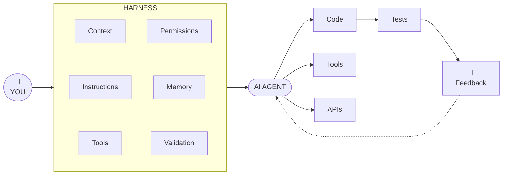

# Oh My Harness! 

The Missing Layer Between You and Your AI Agent

<div class="pt-12">
  <span @click="$slidev.nav.next" class="px-2 py-1 rounded cursor-pointer" hover="bg-white bg-opacity-10">
    <carbon:arrow-right class="inline"/>
  </span>
</div>

<div class="avtar mt-36 rounded-full flex w-full align-center justify-center ">
  

  <a class="text-left ml-4 mt-2" href="https://github.com/sayjeyhi">
    <strong class="text-xl">Jafar Rezaei</strong> <br/>
    <span class="text-gray-400 text-sm">Romania</span>
  </a>
</div>


---
layout: center
class: 'text-center'
---


<div class="text-3xl font-black text-zinc-300 tracking-tight leading-snug">
  "We gave AI a brain.<br/>Then we wondered why it couldn't work like a developer."
</div>

<p class="text-zinc-500 text-lg mt-6">Let's feel the problem before we name the solution.</p>


---

# AI Coding Has Changed 

<br />

We didn't get here overnight. Each step handed the machine more responsibility.

<br />

| Era | What the AI did | You still did |
|-----|-----------------|---------------|
| **Autocomplete** | Finished your line | Everything else |
| **Chat** | Answered questions, drafted snippets | Copy, paste, wire it up |
| **Agents** | Modify code, run commands, test, debug, ship | Decide *what* and *whether* |

<br />

> The model went from suggesting text to **taking actions** in your repo 


---

# The Agent Is Not the Product 

<br />

An LLM alone is **not** a great software engineer. On its own it can only predict the next token.

<br />

To behave like an engineer, it needs:

<br />

- **Context** — what the codebase is, and what "done" means
- **Tools** — a way to actually read, run, and change things
- **Constraints** — what it's allowed to touch
- **Feedback** — how it learns it went wrong
- **A way to operate** — a loop to run inside

<br />

> The model is the brain. A brain in a jar ships nothing. 


---

# Imagine Giving This to a Junior Dev 

<br />

You drop them into Slack on day one:

<br />

> "Here's the repo. Implement this ticket." 

<br />

**What could go wrong?**

<div class="text-sm mt-2">

- No idea which files matter → edits the wrong ones
- Doesn't know the conventions → invents its own
- Never runs the tests → "it works on my machine"
- Ticket is vague or hallucinated → builds the wrong thing
- No one reviews before it ships → surprise in prod

</div>

<br />

> This is exactly how we hand tasks to a raw agent. 


---

# The Agent Loop 

<br />

Agents get powerful not from one clever answer, but from **repeating a loop**.

<br />

<div class="text-center text-2xl font-bold text-zinc-200 tracking-wide">
  Observe → Think → Act → Verify → Repeat
</div>

<br />

| Step | What happens |
|------|--------------|
| **Observe** | Read the repo, the ticket, the last error |
| **Think** | Plan the next small step |
| **Act** | Run a command, edit a file |
| **Verify** | Tests, types, lint — did it work? |
| **Repeat** | Feed the result back in and go again |

<br />

> Remove any step and the loop breaks. The harness is what keeps the loop honest.


---
layout: center
class: 'text-center'
---


<div class="text-4xl font-black text-zinc-300 tracking-tight">
  So… What's a Harness?
</div>

<p class="text-zinc-500 text-lg mt-4">The system around the model that gives it capabilities and boundaries</p>


---

# The Core Equation 

<br />

<div class="text-center text-3xl font-black text-zinc-200 tracking-wide">
  Agent = Model + Harness
</div>

<br />

A **harness** is the software infrastructure wrapped around an LLM that turns it into a working agent — not just something that responds to prompts.

<br />

| Piece | Role | Analogy |
|-------|------|---------|
| **Model** | Reasoning, understanding, next action | The brain |
| **Harness** | Tools, memory, permissions, verification, context | The body & environment |
| **Agent** | The two working together as a system | A working engineer |

<br />

<span class="text-xs text-gray-400">

Framing echoed by Databricks, Zapier, and the "model + harness" language from Hashimoto & OpenAI.

</span>


---
layout: center
class: 'text-center'
---


<div class="text-4xl font-black text-zinc-300 tracking-tight">
  The Missing Layer
</div>

<p class="text-zinc-500 text-lg mt-4">It sits between human intent and raw model capability</p>


---

#  Mental Model 

> The idea is simple

<br/>
<br/>
<br/>




---

# Why the Harness Sits in the Middle 

<br />

Your intent is high-level. The model's raw capability is low-level and unbounded. The harness is the **translation and control layer** between them.

<br />

- **Upward** → it turns fuzzy human intent into concrete, safe operations
- **Downward** → it decides what the model can observe, call, and change
- **Sideways** → it catches failures before they ever reach you

<br />

> You → Harness → Agent → Tools / Codebase / APIs / CI


---

# What's Inside a Harness? 

<div class="text-sm mt-6">

| Component | What it supplies |
|-----------|------------------|
| **Context management** | The right files, docs, and decisions per request |
| **Tools** | Shell, git, tests, search, browser, APIs |
| **Instructions** | System prompt, conventions, "definition of done" |
| **Permissions** | Which actions run freely vs. need approval |
| **Memory** | State that survives across steps |
| **Planning** | Breaking work into verifiable steps |
| **Feedback loops** | Test / type / lint results fed back in |
| **Validation** | Gates that must pass before shipping |
| **Checkpoints** | Safe points to review, revert, or resume |

</div>


---
layout: center
class: 'text-center'
---


<div class="text-4xl font-black text-zinc-300 tracking-tight">
  Context Is King
</div>

<p class="text-zinc-500 text-lg mt-4">The agent needs the <em>right</em> context — not <em>all</em> context</p>


---

# Context Is King 

<br />

More context is not better context. A flooded window is as useless as an empty one.

<br />

**Feed the agent what a good teammate would already know:**

<div class="text-sm">

- Repo conventions — naming, structure, patterns
- Architecture — how the pieces fit together
- The relevant files — not the whole repo
- Docs and specs that actually apply
- Previous decisions — why things are the way they are

</div>

<br />

> Garbage in, garbage out — and this includes your tickets. 


---

# Your Org Is Part of the Harness 

<br />

AI usage has to **flow through the whole company** — not live in one dev's editor.

<br />

- Jira tickets are the **base input** for your AI. If they're vague or wrong, so is the output.
- Confluence pages must stay **realistic** — not AI hallucinations feeding more AI.
- Bad output usually isn't one person's mistake — it's a bad information supply chain.

<br />

> **TL;DR:** Tickets and docs must stay realistic. 

<br />

<span class="text-xs text-gray-400">

"AI makes a good company better, a bad one worse." — see the transformation write-up in Resources.

</span>


---
layout: center
class: 'text-center'
---


<div class="text-4xl font-black text-zinc-300 tracking-tight">
  Give It Tools
</div>

<p class="text-zinc-500 text-lg mt-4">Capability determines what the agent can actually do</p>


---

# Give It Tools 

<br />

A model with no tools can only talk. Tools are its hands.

<div class="text-sm mt-4">

| Tool | Unlocks |
|------|---------|
| **Shell** | Run anything the repo needs |
| **Git** | Branch, diff, commit, review |
| **Tests** | Prove the change works |
| **Code search** | Find the right files fast |
| **Linters / types** | Catch mistakes before they land |
| **Browser / APIs** | Reach the outside world |
| **Deploy tools** | Actually ship |

</div>

<br />

> No test tool → the agent can't know it succeeded. No git → it can't be reviewed. 


---
layout: center
class: 'text-center'
---


<div class="text-4xl font-black text-zinc-300 tracking-tight">
  Trust, but Verify
</div>

<p class="text-zinc-500 text-lg mt-4">Turning autonomous action into a controlled feedback loop</p>


---

# Trust, but Verify 

<br />

Autonomy without verification is just faster mistakes. The harness adds gates.

<br />

- **Tests** — behavior stays correct
- **Type-checking** — contracts stay intact
- **Linting** — style and obvious bugs
- **CI** — the same checks a human PR faces
- **Diffs** — see exactly what changed
- **Human approval** — the final gate for risky actions

<br />

Martin Fowler's split is a useful hook:

- **Feedforward guides** → raise the odds it's right the first time
- **Feedback sensors** → let it self-correct before a human ever looks

<br />

> Verification is what makes autonomy safe enough to trust.


---

# Catch Mistakes Before You Push 

<br />

The cheapest bug is the one that never leaves your machine. Wire checks into the loop.

<br />

- Dead-code / unused-symbol detection (e.g. **Skylos**) before commit
- Pre-commit hooks that run the agent's own validation
- Fail **loud and early** — don't let broken code reach CI

<br />

```bash
# Example: catch dead code the agent left behind before pushing
skylos . --exclude tests
```

<br />

> The harness should make "push broken code" hard, not easy. 


---
layout: center
class: 'text-center'
---


<div class="text-4xl font-black text-zinc-300 tracking-tight">
  Demo: Without a Harness
</div>

<p class="text-zinc-500 text-lg mt-4">A realistic task — and an agent flying blind</p>


---

# Demo: Without a Harness 

<br />

**The task:** "Add pagination to the products endpoint."

<br />

**What the raw agent does:**

<div class="text-sm">

- Edits the **wrong file** — there were two products routes
- Ignores the repo's existing pagination helper — reinvents it
- Uses a different naming style than the rest of the codebase
- Never runs the tests — assumes it works
- Leaves the implementation **half-done** and calls it finished

</div>

<br />

> Confident. Fast. Wrong. 


---
layout: center
class: 'text-center'
---


<div class="text-4xl font-black text-zinc-300 tracking-tight">
  Demo: With a Harness
</div>

<p class="text-zinc-500 text-lg mt-4">Same task — instructions + context + tools + validation</p>


---

# Demo: With a Harness 

<br />

**Same task. Same model. Different result.**

<div class="text-sm mt-2">

| Without | With harness |
|---------|--------------|
| Guesses the file | Code search points to the real route |
| Reinvents pagination | Instructions surface the existing helper |
| Random naming | Conventions loaded as context |
| Skips tests | Test tool + CI gate force verification |
| Half-done | Loop repeats until validation passes |

</div>

<br />

> The model didn't get smarter. The **system around it** did. 


---

# Harness ≠ Prompt 

<br />

This is the distinction that makes "Oh My Harness!" click.

<br />

| A prompt | A harness |
|----------|-----------|
| Tells the model **what to do** | Decides what it **can know** |
| One message | What it **can do** |
| No memory of the system | How it **knows it's done** |
| Static | A living loop |

<br />

> A prompt is a sentence. A harness is the whole workshop the sentence runs in. 


---

# Build vs Buy 

<br />

You don't always build a harness from scratch — many great ones exist.

<div class="text-sm mt-2">

| Harness | Optimized for |
|---------|---------------|
| **Claude Code / Codex** | Terminal-native, scriptable agents |
| **Cursor** | In-editor, tight edit loop |
| **Kiro** | Spec-driven, structured workflows |
| **OpenCode** | Open, hackable, self-hosted |
| **DeepSeek Harness** | Plug-in coding agent around the model |
| **Custom internal** | Your org's conventions & guardrails |

</div>

<br />

> Different harnesses optimize for different workflows — pick the loop that fits your team.


---

# The Future Is Agentic 

<br />

The models are converging. The **harness** is where the edge is.

<br />

- Google's estimate: the LLM is ~**10%** of an agentic system — the harness is the other **90%**
- Stripe reportedly ships ~**1,300** AI-written PRs a week — the differentiator is the harness, not a secret model
- "What model does it use?" is increasingly the **wrong question**

<br />

> The advantage shifts from *which* model you use → *how well* you orchestrate it. 


---
layout: center
class: 'text-center'
---

# Oh My Harness! 

<br />

<div class="text-left mx-auto max-w-lg text-zinc-300 text-lg">

- **Model** = the brain 
- **Tools** = the hands 
- **Context** = the knowledge 
- **Harness** = the system that makes the agent actually useful 

</div>

<br />

> We gave AI a brain. The harness is what finally lets it work like a developer.


---

# Resources 

<br />

- **AI transformation:** [dpereira.substack.com — Just Another Transformation](https://dpereira.substack.com/p/just-another-transformation)
- **Harness engineering:** [martinfowler.com](https://martinfowler.com)
- **DeepSeek Harness:** [github.com/deepseek-ai/deepseek-harness](https://github.com/deepseek-ai/deepseek-harness)
- **DeepSeek Harness explained:** [mindstudio.ai/blog/deepseek-harness-agentic-coding](https://www.mindstudio.ai/blog/deepseek-harness-agentic-coding)
- **Harness deep-dive (video):** [youtu.be/UsfCe5fJK6A](https://youtu.be/UsfCe5fJK6A)
- **Skylos — catch AI mistakes before push:** [github.com/duriantaco/skylos](https://github.com/duriantaco/skylos)


---
layout: center
class: 'text-center'
---

# Q&A 

<br />

<div class="text-2xl font-bold text-zinc-200">

"So… what would you let <em>your</em> agent do?" 

</div>

<div class="avtar mt-12 rounded-full flex w-full align-center justify-center ">
  

  <a class="text-left ml-4 mt-2" href="https://github.com/sayjeyhi">
    <strong class="text-xl">Jafar Rezaei</strong> <br/>
    <span class="text-gray-400 text-sm">@sayjeyhi</span>
  </a>
</div>
